# Article 9 - Semantic Search and Information Retrieval with Transformers


# From Keywords to Neural Understanding: The Transformer Revolution in Search

Modern information retrieval has undergone a profound transformation. Where once we struggled with keyword limitations and boolean operators, today's semantic search unlocks the true meaning behind our questions. This chapter explores how transformer models have revolutionized search by bridging the gap between what users ask and what they truly seek.

We'll journey through:

- The **fundamental shift** from lexical matching to semantic understanding
- How **transformer architectures** create rich, contextual embeddings that capture meaning
- **Vector databases** that make these embeddings searchable at scale
- **Real-world applications** across customer support, knowledge management, and legal discovery
- The **latest advancements** including RAG integration and specialized domain models

By understanding both the theory and practical implementation of transformer-based search, you'll gain the tools to build systems that truly comprehend user intent—not just match strings. Let's explore how these neural networks have fundamentally changed what's possible in information retrieval.

# Semantic Search and Information Retrieval with Transformers - Article 9

```mermaid
mindmap
  root((Semantic Search & Information Retrieval))
    From Keywords to Understanding
      Keyword Limitations
      Context Recognition
      Meaning-Based Retrieval
    Transformer Embeddings
      Dense Vectors
      Sentence Transformers
      Multilingual Models
      Domain Adaptation
    Vector Databases & FAISS
      Scalable Storage
      Fast Similarity Search
      Production Integration
      Hybrid Approaches
    Business Applications
      Customer Support
      Knowledge Management
      Legal Discovery
      Enterprise Search
    Modern Features
      RAG Integration
      Long-Context Support
      Cloud APIs
      MTEB Benchmarks

```



**Topics covered: Semantic Search & Information Retrieval**

- Shows transition **From Keywords to Understanding** with limitations and benefits
- Covers **Transformer Embeddings** including models and adaptations
- Details **Vector Databases & FAISS** for scalable implementation
- Highlights **Business Applications** across industries
- Includes **Modern Features** like RAG and benchmarking

## Introduction: From Keyword Search to True Understanding

Ever chased a critical document that you *know* exists, but can't find because you're using the wrong words? That's keyword search failing you. Today's transformer models transform this frustration into fluid discovery. They understand **meaning**, not just matching letters.

Picture searching a massive warehouse for a red umbrella. Keyword search gives you a flashlight that only illuminates boxes labeled "red." Miss the one marked "crimson parasol"? Too bad. You'll walk right past it.

Now imagine a brilliant assistant who grasps that crimson equals red, and parasol means umbrella. They understand your **intent**, not just your words. That's semantic search—it discovers meaning, not just matches.

**Semantic search** harnesses transformer models—deep learning architectures that capture relationships between words in context. Instead of literal matching, transformers encode the essence behind text. "Refund policy" and "money back guarantee" become neighbors in meaning space, even sharing zero words.

Let's witness this transformation with Python. We'll contrast keyword and semantic search using the latest `sentence-transformers` library and production-ready patterns.

This builds on my previous exploration of custom data workflows in [Custom Data Workflows Matter—Article 8](https://medium.com/@richardhightower/customizing-pipelines-and-data-workflows-advanced-models-and-efficient-processing-1ba9fabdca9a), and for foundational transformer mechanics, see my blog post [Inside the Transformer: Architecture and Attention Demystified - A Complete Guide](https://cloudurable.com/blog/article-4-inside-the-transformer-architecture-and/).

### Setting Up Your Environment with Python 3.12.9

To get started with semantic search, we need to set up our Python environment and import the necessary libraries. This example demonstrates the initial setup from the interactive tutorial notebook:

```python
# Set environment variable to avoid tokenizers warning
import os
os.environ['TOKENIZERS_PARALLELISM'] = 'false'

# Import necessary libraries
import numpy as np
import pandas as pd
import matplotlib.pyplot as plt
import seaborn as sns
from sentence_transformers import SentenceTransformer, util
from rank_bm25 import BM25Okapi
import warnings
warnings.filterwarnings('ignore')

# Set up plotting style
plt.style.use('seaborn-v0_8-darkgrid')
sns.set_palette("husl")

print("Libraries imported successfully!")
print(f"NumPy version: {np.__version__}")
print(f"Pandas version: {pd.__version__}")
```

**Step-by-Step Explanation:**

1. **Environment Setup**: Set tokenizers parallelism to avoid warnings in notebook environments
2. **Import Core Libraries**: Load essential packages for numerical computation, data manipulation, and visualization
3. **Import Search Components**: Load sentence transformers for semantic search and BM25 for keyword search
4. **Configure Visualization**: Set up consistent plotting style for clear visual outputs
5. **Verify Installation**: Print versions to ensure proper setup

### Keyword Search vs. Semantic Search: A Modern Comparison

Let's now explore the practical application of both keyword and semantic search methods with a detailed code example. The following listing demonstrates a side-by-side comparison that highlights the fundamental differences between these approaches.

This example will show:

- How traditional keyword search fails when exact word matching isn't present
- How transformer-based semantic search correctly identifies relevant content through meaning
- The practical implementation using the sentence-transformers library
- Why semantic search produces superior results for natural language queries

The code sample uses a realistic FAQ scenario where a user's query about forgotten login credentials should match documents about password recovery, despite not sharing the same keywords:

```python
# Define our FAQ documents
faqs = [
    "How can I reset my password?",
    "What are the steps for account recovery?",
    "How do I request a refund?",
    "Information about our privacy policy.",
    "How to update billing information?",
    "Contact customer support for help.",
    "Two-factor authentication setup guide.",
    "Troubleshooting login issues."
]

# User query that doesn't match keywords exactly
query = "I forgot my login credentials"

print(f"User Query: '{query}'")
print("\n" + "="*50 + "\n")

# Keyword Search Implementation
def keyword_search(query, documents):
    """Simple keyword matching search"""
    query_words = set(query.lower().split())
    matches = []
    
    for doc in documents:
        doc_words = set(doc.lower().split())
        if query_words & doc_words:  # Intersection
            matches.append(doc)
    
    return matches

# Perform keyword search
keyword_results = keyword_search(query, faqs)
print("🔍 KEYWORD SEARCH RESULTS:")
if keyword_results:
    for i, result in enumerate(keyword_results, 1):
        print(f"  {i}. {result}")
else:
    print("  No matches found! ❌")
    print("  (No shared words between query and documents)")
```

**Step-by-Step Explanation:**

1. **Define FAQs and Query**: Create sample documents and a user question that doesn't match keywords exactly
2. **Keyword Search**: Split query into words, find FAQs sharing any word—misses relevant answers when wording differs
3. **Check Intersection**: Use set intersection to find common words between query and documents
4. **Display Results**: Show which documents matched, or indicate no matches found
5. **Highlight Limitation**: Demonstrate how exact word matching fails for natural language queries

Now let's see how semantic search handles the same query:

```python
# Semantic Search Implementation
def semantic_search(query, documents, model, top_k=3):
    """Semantic search using sentence transformers"""
    # Encode query and documents
    query_embedding = model.encode(query, convert_to_numpy=True)
    doc_embeddings = model.encode(documents, convert_to_numpy=True)
    
    # Calculate cosine similarities
    similarities = util.cos_sim(query_embedding, doc_embeddings)[0]
    
    # Get top-k results
    top_results = similarities.argsort(descending=True)[:top_k]
    
    results = [(documents[idx], float(similarities[idx])) for idx in top_results]
    return results

# Perform semantic search
semantic_results = semantic_search(query, faqs, model)
print("\n🧠 SEMANTIC SEARCH RESULTS:")
for i, (doc, score) in enumerate(semantic_results, 1):
    print(f"  {i}. {doc}")
    print(f"     (Similarity score: {score:.3f})")
```

**Step-by-Step Explanation:**

1. **Generate Embeddings**: Convert query and documents into dense vectors capturing semantic essence
2. **Calculate Similarity**: Use cosine similarity to measure meaning closeness between vectors
3. **Rank Results**: Sort FAQs by similarity score—most relevant surfaces first
4. **Return Top Matches**: Extract the most semantically similar documents
5. **Display with Scores**: Show results with confidence scores indicating semantic similarity

Notice how keyword search returns nothing (no shared words), while semantic search correctly identifies password/account recovery FAQs as relevant. That's the power of understanding **meaning**.

Why does this transformation matter for business?

- **Customer Support**: Users rarely phrase questions matching your documentation. Semantic search bridges this gap
- **Enterprise Knowledge**: Employees discover procedures using their own terminology
- **Legal Compliance**: Lawyers surface relevant precedents by meaning, not exact phrasing

Transformers fuel this leap. They absorb context and nuance from massive datasets, enabling search that transcends surface matching.

**Key takeaway**: Semantic search, powered by transformers, unlocks genuine language understanding. This shift proves vital for building smarter, more intuitive search across domains.

🔎 **Production Note:** Real-world semantic search stores embeddings in vector databases (FAISS, Milvus, Weaviate) for efficient scaling to millions of documents. We'll explore this shortly.

🌐 **Looking Ahead:** Recent advances include retrieval-augmented generation (RAG), Mixture of Experts architectures, and multimodal search combining text, images, and video. For a deeper dive into RAG's evolution and why it's far from dead, check my analysis in [Is RAG Dead? Anthropic Says No](https://medium.com/@richardhightower/is-rag-dead-anthropic-says-no-290acc7bd808). Complement this with my blog on multimodal extensions in [Beyond Language: Transformers for Vision, Audio, and Multimodal AI - Article 7](https://cloudurable.com/blog/article-7-beyond-language-transformers-for-vision/), which explores how semantic search evolves beyond text.

## Introduction to Semantic Search

Search drives how we navigate information—from company wikis to legal archives. Traditional engines focus on exact matches, missing true intent. Semantic search revolutionizes this by understanding **meaning and context**, leveraging transformer embeddings.

You'll master how semantic search surpasses keyword matching, why transformer embeddings excel at capturing meaning, and which metrics prove search quality. We'll introduce production practices—vector databases, hybrid search, modern evaluation tools—through practical examples.


**Step-by-Step Explanation:**

- **Traditional Search** path shows query going through keyword engine to limited results
- User becomes frustrated when intent is missed
- **Semantic Search** path shows both query and documents becoming embeddings
- Transformer creates vectors that capture meaning
- Similarity matching produces relevant results
- User achieves satisfaction through understood intent

### Keyword vs. Semantic Search

Picture searching for "resetting your password." Keyword search only finds documents containing "reset" and "password"—missing "Account recovery steps" despite being your answer.

Think of keyword search as a rigid librarian who only fetches books with your exact phrase. Fast, but inflexible. Synonyms or paraphrasing derail it completely.

Semantic search resembles an insightful librarian who grasps your meaning. It connects "resetting password" with "account recovery" by matching **intent**, not letters. This magic happens through embeddings—numeric vectors representing text meaning, generated by transformers.

Embeddings capture context and word relationships. We compare meanings using **cosine similarity**—a mathematical measure of vector direction closeness. Nearby vectors share similar meaning.

### Comparing Keyword and Semantic Search Results

```python
import sys
print(f"Python version: {sys.version}")

# Load the sentence transformer model
print("\nLoading sentence transformer model...")
model = SentenceTransformer('all-MiniLM-L6-v2')
print("Model loaded successfully!")

# Test the model with a simple example
test_sentence = "Hello, world!"
test_embedding = model.encode(test_sentence)
print(f"\nTest embedding shape: {test_embedding.shape}")
print(f"Embedding dimension: {len(test_embedding)}")
```

**Step-by-Step Explanation:**

1. **Verify Python Version**: Ensure we're using Python 3.12.9 for consistency
2. **Load Transformer**: Initialize model that creates semantic embeddings
3. **Test Embedding**: Generate a sample embedding to verify model is working
4. **Check Dimensions**: Confirm embeddings are 384-dimensional vectors
5. **Ready for Search**: Model is prepared to encode documents and queries

Try modifying the query to "forgot login details"—watch how results shift. This demonstrates semantic search uncovering relevance that keyword search misses entirely.

Production systems scale by storing embeddings in vector databases (FAISS, Milvus, Pinecone, Weaviate, Postgres + VectorDB, AlloyDB), enabling lightning-fast similarity search across millions of documents.

Modern engines combine keyword and semantic search (hybrid search) maximizing precision and recall. Reranking models (cross-encoders, LLMs) further refine top results.

**Key Takeaway:** Semantic search matches meaning, not just words. Transformer embeddings plus vector databases deliver helpful, scalable, accurate results.

### Hybrid Search: Combining Keyword and Semantic Approaches

After discussing keyword vs. semantic search, let's explore how to combine both approaches for optimal results. Hybrid search leverages the precision of keyword matching with the understanding of semantic search.

```python
# Import our hybrid search implementation
import sys
sys.path.append('../src')
from hybrid_search import HybridSearchEngine

# Create sample documents
documents = [
    "How to reset your password: Click forgot password on login page",
    "Account recovery steps for forgotten credentials",
    "Password reset instructions and security guidelines",
    "Update your profile information in account settings",
    "Two-factor authentication setup guide",
    "Troubleshooting login issues and access problems",
    "Security best practices for strong passwords",
    "How to change your email address in settings",
    "Recovering locked accounts after failed login attempts",
    "Password manager recommendations for secure storage"
]

# Initialize hybrid search engine
hybrid_engine = HybridSearchEngine()
hybrid_engine.index_documents(documents)
print("Hybrid search engine initialized!")
```

**Step-by-Step Explanation:**

1. **Import Hybrid Engine**: Load the hybrid search implementation that combines approaches
2. **Create Document Set**: Prepare diverse documents covering various topics
3. **Initialize Engine**: Create hybrid search engine with default weights
4. **Index Documents**: Build both BM25 index and semantic embeddings
5. **Ready for Search**: System prepared to handle queries with adaptive weighting

Let's test the hybrid approach with different query types:

```python
# Test different queries with varying lengths
test_queries = [
    "reset",  # Very short - keyword heavy
    "forgot password",  # Short - balanced
    "I can't remember my login",  # Medium - balanced  
    "What are the steps to recover my account when I've forgotten my password?"  # Long - semantic heavy
]

# Compare search approaches
results_comparison = []

for query in test_queries:
    # Get adaptive weights
    kw_weight, sem_weight = hybrid_engine.adaptive_weighting(query)
    
    # Perform search
    results = hybrid_engine.search(query, k=3, return_scores=True)
    
    results_comparison.append({
        'query': query,
        'query_length': len(query.split()),
        'keyword_weight': kw_weight,
        'semantic_weight': sem_weight,
        'top_result': results[0]['document'][:50] + '...' if results else 'No results',
        'top_score': results[0]['hybrid_score'] if results else 0
    })

# Create comparison table
comparison_df = pd.DataFrame(results_comparison)
print("\n🔍 Adaptive Weight Analysis:")
print("="*80)
display(comparison_df)
```

**Step-by-Step Explanation:**

1. **Define Test Queries**: Create queries of varying lengths to test adaptive weighting
2. **Calculate Weights**: System automatically adjusts keyword/semantic balance based on query
3. **Perform Searches**: Execute hybrid search with adaptive weights
4. **Collect Results**: Gather top matches and scores for analysis
5. **Display Analysis**: Show how weights adapt to query characteristics

This hybrid approach often outperforms either method alone, especially in domains where specific terminology matters but users may phrase queries differently.

### Business Applications of Semantic Search

Semantic search isn't merely technical evolution—it's competitive advantage. Real-world impact:

1. **Enterprise Knowledge Bases:** Employees use varied terminology. Semantic search bridges vocabulary gaps, surfacing answers regardless of phrasing.
2. **Customer Support Automation:** Intent-aware chatbots understand "How can I get my money back?" matches refund policies—without the word "refund."
3. **Legal and Compliance Discovery:** Legal teams find relevant precedents through meaning, not just keywords—saving hours, reducing risk. This aligns with enterprise use cases I've covered in [The Economics of Deploying Large Language Models: Costs, Value, and 99.7% Savings](https://medium.com/@richardhightower/the-economics-of-deploying-large-language-models-costs-value-and-99-7-savings-d1cd9a84fcbe), and for scaling such systems, refer to my blog post [Scaling Up: Debugging, Optimization, and Distributed Training - Article 17](https://cloudurable.com/blog/scaling-up-debugging-optimization-a/).

Production deployments leverage scalable vector databases for efficient embedding retrieval, often combining keyword and semantic methods for peak accuracy.

**Summary:** Semantic search reduces friction, boosts satisfaction, makes knowledge work efficient—especially with cutting-edge embedding models and infrastructure.

### Vector Database Comparison Table

| Database | Type | Strengths | Best For | Scaling |
| --- | --- | --- | --- | --- |
| **FAISS** | Open-source library | Fast, flexible indices | Research, custom deployments | Manual sharding |
| **PostgreSQL + pgvector** | Extension | ACID, SQL integration, mature | Enterprise with existing PG | Vertical + read replicas |
| **Pinecone** | Managed cloud | Zero-ops, auto-scaling | SaaS applications | Automatic |
| **Weaviate** | Open-source + cloud | GraphQL API, hybrid search | Enterprise search | Horizontal |
| **Milvus** | Open-source + cloud | GPU support, high performance | Large-scale ML | Distributed |
| **Qdrant** | Open-source + cloud | Rust-based, filtering | Real-time applications | Cloud-native |
| **Chroma** | Embedded/cloud | Simple API, developer-friendly | Prototyping, RAG | In-memory to cloud |

### Measuring Search Quality: Metrics that Matter

Building search is half the battle. Proving it works requires clear metrics:

1. **Precision:** What fraction of results are relevant? High precision minimizes irrelevant noise.
2. **Recall:** What fraction of relevant documents appeared? High recall ensures nothing important is missed.
3. **F1 Score:** Harmonizes precision and recall into one balanced metric.
4. **Mean Reciprocal Rank (MRR):** How high does the first relevant result appear? Top placement delights users.
5. **Normalized Discounted Cumulative Gain (NDCG):** Evaluates entire ranking, rewarding relevant results near the top—crucial for result lists.

### Calculating Precision and Recall for Search Results

```python
# Implement search quality metrics
def calculate_metrics(retrieved, relevant):
    """
    Calculate precision, recall, and F1 score
    """
    retrieved_set = set(retrieved)
    relevant_set = set(relevant)
    
    true_positives = len(retrieved_set & relevant_set)
    
    precision = true_positives / len(retrieved_set) if retrieved_set else 0
    recall = true_positives / len(relevant_set) if relevant_set else 0
    f1 = 2 * (precision * recall) / (precision + recall) if (precision + recall) > 0 else 0
    
    return precision, recall, f1

# Example evaluation
test_cases = [
    {
        'name': 'Perfect Match',
        'retrieved': ['doc1', 'doc2', 'doc3'],
        'relevant': ['doc1', 'doc2', 'doc3']
    },
    {
        'name': 'Partial Match',
        'retrieved': ['doc1', 'doc2', 'doc5'],
        'relevant': ['doc2', 'doc3', 'doc5']
    },
    {
        'name': 'Poor Match',
        'retrieved': ['doc1', 'doc4', 'doc6'],
        'relevant': ['doc2', 'doc3', 'doc5']
    }
]

metrics_results = []
for case in test_cases:
    precision, recall, f1 = calculate_metrics(case['retrieved'], case['relevant'])
    metrics_results.append({
        'Scenario': case['name'],
        'Precision': precision,
        'Recall': recall,
        'F1 Score': f1
    })

metrics_df = pd.DataFrame(metrics_results)
```

**Step-by-Step Explanation:**

1. **Define Sets**: Retrieved documents vs. truly relevant documents
2. **Calculate Intersection**: Find documents that are both retrieved and relevant
3. **Compute Precision**: Fraction of retrieved that are relevant
4. **Compute Recall**: Fraction of relevant that were retrieved
5. **Calculate F1**: Harmonic mean balancing precision and recall

Practice requires averaging metrics across many queries. For ranking metrics (MRR, NDCG), libraries like Hugging Face's `evaluate`, `scikit-learn`, or `pytrec_eval` automate calculations.

**Mean Reciprocal Rank (MRR):** This metric focuses on the position of the first relevant result. The reciprocal rank is 1 divided by the rank position of the first relevant document. For example, if the first relevant document appears at position 3, the reciprocal rank is 1/3 = 0.33. MRR averages this value across multiple queries. Higher MRR values (closer to 1.0) indicate better search performance where relevant results appear early in the results list.

**Normalized Discounted Cumulative Gain (NDCG):** This metric evaluates the entire ranking quality, not just the first relevant hit. It considers both the relevance of results and their positions. NDCG gives higher weight to relevant documents appearing earlier in search results, following the principle that users typically focus on top results. The metric is "normalized" by comparing the actual ranking to an ideal ranking where all relevant documents appear first in order of relevance. NDCG ranges from 0 to 1, with 1 representing perfect ranking.

Both metrics are essential for evaluating real-world search systems where result ordering significantly impacts user experience. MRR is simpler and focuses on finding the first correct answer quickly, while NDCG provides a more comprehensive view of overall ranking quality across multiple positions.

Choose metrics matching your goals. Customer support needs high recall—never miss helpful articles. Legal search demands high precision—avoid irrelevant results.

**Key Point:** Metrics transform search quality from guesswork into measurable outcomes, guiding continuous improvement.

## Embedding Text for Search Applications

Imagine organizing a vast library by **meaning**, not titles. That's semantic search's challenge—embeddings solve it. You'll learn to transform text into vectors, store them efficiently, adapt for languages and specialized domains. We'll highlight cutting-edge models and databases for future-proof, production-ready solutions.


**Step-by-Step Explanation:**

- Start with **RawText** that needs embedding
- Text goes through **Tokenization** preprocessing
- **TransformerModel** encodes tokens into **Embeddings**
- Embeddings stored in **VectorDatabase** and indexed
- System becomes **SearchReady**
- Parallel paths handle **Multilingual** and **Domain-specific** content

Coverage includes:

1. What embeddings are and their importance
2. Creating them with sentence transformers and modern APIs
3. Storing and managing embeddings at scale
4. Multilingual and domain-specific strategies
5. Selecting optimal models and databases

### What Are Embeddings—and Why Do They Matter?

An embedding is a numerical fingerprint—a vector—capturing text meaning. Picture it as DNA for sentences. Similar meanings yield similar embeddings, clustering in vector space.

Consider:

- "How do I reset my password?"
- "What are the steps to recover my account?"

Keyword search sees these as unrelated. Embeddings recognize their semantic kinship, enabling intelligent matching.

Practical impact? Embeddings power:

- Customer question routing to relevant help articles—despite different wording
- Support ticket clustering by issue type
- Cross-language search focusing on meaning
- Retrieval-augmented generation (RAG) combining search with LLMs for reasoning

I've explored practical RAG implementations in [Beyond Chat: Enhancing LiteLLM Multi-Provider App with RAG, Streaming, and AWS Bedrock](https://medium.com/@richardhightower/beyond-chat-enhancing-litellm-multi-provider-app-with-rag-streaming-and-aws-bedrock-65767dd34a53). For the foundational step of tokenization that underpins embeddings, see my blog post [Article 5: Tokenization - Converting Text to Numbers for Neural Networks](https://cloudurable.com/blog/article-5-tokenization-converting-text-to-number/).

**Bottom line**: Embeddings translate language into comparable meanings, not just matched strings.

### Generating Embeddings with Sentence Transformers and Modern APIs

While classic transformers like BERT understand language, they weren't designed for sentence comparison. **Sentence transformers** train specifically to cluster similar meanings—perfect for search. Recent APIs (Google Gemini, OpenAI, Cohere) raise the bar for multilingual and domain performance.

The `sentence-transformers` library remains essential for local workflows. For English, `'all-MiniLM-L6-v2'` delivers speed and accuracy. Production deployments often use cloud APIs or cutting-edge open models. **Pro tip:** Check the [MTEB leaderboard](https://huggingface.co/spaces/mteb/leaderboard) for latest benchmarks.

### Generating Embeddings with Sentence Transformers

```python
# Generate embeddings for different types of sentences
sentences = [
    # Similar meanings
    "How do I reset my password?",
    "What are the steps to recover my account?",
    "I forgot my login credentials",
    
    # Different topic
    "The weather is nice today",
    "It's a beautiful sunny day",
    
    # Another different topic
    "Machine learning is fascinating",
    "AI and deep learning are interesting"
]

# Generate embeddings
embeddings = model.encode(sentences)
print(f"Generated embeddings for {len(sentences)} sentences")
print(f"Embedding shape: {embeddings.shape}")
```

**Step-by-Step Explanation:**

1. **Define Sentence Groups**: Create sentences with similar and different meanings
2. **Generate Embeddings**: Convert sentences to 384-dimensional vectors
3. **Verify Output**: Confirm embedding dimensions match expectations
4. **Understand Structure**: Each sentence maps to a fixed-size vector
5. **Ready for Comparison**: Embeddings can now be compared for similarity

Similar sentences produce similar vectors, enabling meaningful comparison. For other languages or industries, choose models trained on relevant data. Modern APIs support longer sequences—essential for document search and RAG.

For state-of-the-art performance, explore Google Gemini Embedding, OpenAI's latest APIs, or top MTEB models supporting extended inputs, superior accuracy, and broader language coverage. If you are using AWS Bedrock, Cohere's embeddings are probably your best bet.

### Visualizing Embeddings in 2D

Let's reduce the dimensionality of embeddings to visualize them in 2D space using t-SNE:

```python
from sklearn.manifold import TSNE

# Generate more embeddings for better visualization
categories = {
    "Password/Login": [
        "How do I reset my password?",
        "Forgot my login credentials",
        "Account recovery steps",
        "Can't access my account"
    ],
    "Billing/Payment": [
        "How to update payment method?",
        "Request a refund",
        "Billing information update",
        "Payment failed issues"
    ],
    "Technical Support": [
        "App crashes frequently",
        "Software bug report",
        "Technical difficulties",
        "System error messages"
    ]
}

# Prepare data
all_sentences = []
labels = []
colors = []
color_map = {'Password/Login': 'red', 'Billing/Payment': 'green', 'Technical Support': 'blue'}

for category, sents in categories.items():
    all_sentences.extend(sents)
    labels.extend([category] * len(sents))
    colors.extend([color_map[category]] * len(sents))

# Generate embeddings
all_embeddings = model.encode(all_sentences)

# Apply t-SNE
tsne = TSNE(n_components=2, random_state=42, perplexity=5)
embeddings_2d = tsne.fit_transform(all_embeddings)
```

**Step-by-Step Explanation:**

1. **Organize by Category**: Group sentences into meaningful categories
2. **Prepare Labels**: Track category membership for visualization
3. **Generate All Embeddings**: Create vectors for entire dataset
4. **Apply Dimensionality Reduction**: Use t-SNE to project to 2D space
5. **Visualize Clustering**: Similar meanings cluster together in 2D

### RAG: Combining Search with Generation

Since RAG (Retrieval-Augmented Generation) is increasingly important, let's see how embeddings feed into generative AI:

```python
# Create a knowledge base
knowledge_base = [
    "Our refund policy allows returns within 30 days of purchase. To initiate a refund, contact customer support with your order number.",
    "Password reset: Click 'Forgot Password' on the login page. Enter your email address and check your inbox for reset instructions.",
    "Two-factor authentication adds an extra layer of security. Enable it in your account settings under the Security tab.",
    "Premium subscription includes unlimited storage, priority support, and advanced analytics features for $19.99/month.",
    "Technical support is available 24/7 via email at support@example.com or through live chat on our website.",
    "Account suspension may occur due to policy violations. Contact support to appeal or learn more about the suspension.",
    "Data privacy: We use industry-standard encryption and never share your personal information with third parties.",
    "API rate limits: Free tier allows 1000 requests/day. Premium users get 10,000 requests/day with no throttling."
]

# Create embeddings for knowledge base
kb_embeddings = model.encode(knowledge_base)
print(f"Knowledge base contains {len(knowledge_base)} documents")
```

**Step-by-Step Explanation:**

1. **Define Knowledge Base**: Create documents covering various topics
2. **Generate KB Embeddings**: Convert all documents to vectors
3. **Store for Retrieval**: Embeddings ready for similarity search
4. **Enable RAG**: System can now retrieve relevant context
5. **Support Generation**: Retrieved docs provide context for answers

### Simple RAG Implementation

```python
# Simple RAG implementation
def simple_rag(query, knowledge_base, kb_embeddings, model, top_k=2):
    """
    Simple RAG: Retrieve relevant context and generate response
    """
    # Step 1: Retrieve relevant documents
    query_embedding = model.encode(query)
    similarities = util.cos_sim(query_embedding, kb_embeddings)[0]
    top_indices = similarities.argsort(descending=True)[:top_k]
    
    # Get retrieved documents
    retrieved_docs = [knowledge_base[idx] for idx in top_indices]
    retrieved_scores = [float(similarities[idx]) for idx in top_indices]
    
    # Step 2: Create context for generation
    context = "\n\n".join(retrieved_docs)
    
    # Step 3: Generate response (using a simple template for demonstration)
    # In production, you would use a proper LLM here
    response = f"""Based on the information in our knowledge base:

{context}

To answer your question about '{query}':
{retrieved_docs[0]}

This information was retrieved with {retrieved_scores[0]:.1%} confidence."""
    
    return response, retrieved_docs, retrieved_scores

# Test RAG system
test_questions = [
    "How do I get a refund?",
    "Is my data secure?",
    "What are the API limits?"
]

for question in test_questions:
    print(f"\n{'='*60}")
    print(f"❓ Question: {question}")
    response, docs, scores = simple_rag(question, knowledge_base, kb_embeddings, model)
    print(f"\n📚 Retrieved Documents:")
    for i, (doc, score) in enumerate(zip(docs, scores)):
        print(f"  {i+1}. (Score: {score:.3f}) {doc[:80]}...")
    print(f"\n💡 Generated Response:")
    print(response)
```

**Step-by-Step Explanation:**

1. **Embed Query**: Convert user question to vector
2. **Find Similar Documents**: Calculate cosine similarity with knowledge base
3. **Retrieve Top Matches**: Get most relevant documents
4. **Build Context**: Combine retrieved documents
5. **Generate Response**: Use context to answer question

Note: Use larger models like Llama-2 or GPT-4 for better production results. This demonstrates how semantic search enables more accurate, grounded AI responses.

### Batch Processing and Storing Embeddings

Real systems handle thousands of documents—product catalogs, support tickets, articles. Batch processing accelerates embedding creation. You'll need persistent storage for search. **Vector databases** are now industry standard for production.

### Batch Embedding with FAISS

```python
# Generate a larger dataset for FAISS demonstration
import numpy as np
np.random.seed(42)

# Create synthetic documents
num_documents = 1000
categories = ['tech', 'health', 'finance', 'education', 'travel']
synthetic_docs = []

templates = {
    'tech': ['software', 'hardware', 'programming', 'AI', 'data'],
    'health': ['wellness', 'medicine', 'fitness', 'nutrition', 'mental'],
    'finance': ['investment', 'banking', 'budget', 'savings', 'credit'],
    'education': ['learning', 'teaching', 'courses', 'degree', 'skills'],
    'travel': ['vacation', 'destination', 'flights', 'hotels', 'adventure']
}

for i in range(num_documents):
    cat = np.random.choice(categories)
    word = np.random.choice(templates[cat])
    synthetic_docs.append(f"Document about {word} in {cat} category #{i}")

print(f"Generated {len(synthetic_docs)} synthetic documents")
print("\nSample documents:")
for i in range(5):
    print(f"  - {synthetic_docs[i]}")

# Generate embeddings for all documents
print("Generating embeddings...")
doc_embeddings = model.encode(synthetic_docs, batch_size=32, show_progress_bar=True)
doc_embeddings = doc_embeddings.astype('float32')  # FAISS requires float32

print(f"\nEmbeddings shape: {doc_embeddings.shape}")
print(f"Memory usage: {doc_embeddings.nbytes / 1024 / 1024:.2f} MB")
```

**Step-by-Step Explanation:**

1. **Create Large Dataset**: Generate 1000 synthetic documents across categories
2. **Batch Encode**: Process documents in batches of 32 for efficiency
3. **Convert to Float32**: FAISS requires specific data type
4. **Track Memory Usage**: Monitor resource consumption
5. **Ready for Indexing**: Embeddings prepared for vector database

⚡ **Pro Tip:** Always maintain document ID mapping. Track which embedding corresponds to which document—critical for retrieving correct text later.

For production search, choose vector databases like FAISS, Qdrant, Milvus, or Chroma—optimized for embedding storage and similarity search at scale.

**Summary**: Batch processing and organized storage enable scalable semantic search. Select databases matching your performance and deployment needs.

### Multilingual and Domain-Specific Embeddings

Global businesses operate across languages and specialized fields. How do embeddings capture meaning across these dimensions? Recent advances dramatically improve multilingual and domain performance.

**Multilingual embeddings:**
Models like `'paraphrase-multilingual-MiniLM-L12-v2'` support 50+ languages. Google Gemini and OpenAI embeddings offer even broader coverage. Similar meanings cluster together regardless of language.

### Generating Multilingual Embeddings

For effective multilingual search, we need specialized embedding models that understand semantic meaning across different languages. Let's explore how to generate these powerful cross-language embeddings.

```python
# Load multilingual model
print("Loading multilingual model...")
multilingual_model = SentenceTransformer('paraphrase-multilingual-MiniLM-L12-v2')
print("Multilingual model loaded!")

# Create multilingual FAQ dataset
multilingual_faqs = [
    # English
    "How do I reset my password?",
    "Contact customer support",
    "Refund policy information",
    
    # Spanish
    "¿Cómo puedo restablecer mi contraseña?",
    "Contactar con atención al cliente",
    "Información sobre política de reembolso",
    
    # French
    "Comment réinitialiser mon mot de passe?",
    "Contacter le support client",
    "Informations sur la politique de remboursement",
    
    # German
    "Wie kann ich mein Passwort zurücksetzen?",
    "Kundensupport kontaktieren",
    "Informationen zur Rückerstattungsrichtlinie"
]

languages = ['English', 'English', 'English', 
             'Spanish', 'Spanish', 'Spanish',
             'French', 'French', 'French',
             'German', 'German', 'German']

# Generate multilingual embeddings
multilingual_embeddings = multilingual_model.encode(multilingual_faqs)
```

**Step-by-Step Explanation:**

1. **Load Multilingual Model**: Initialize model supporting multiple languages
2. **Define Multilingual Sentences**: Same meaning in four languages
3. **Track Languages**: Maintain language labels for analysis
4. **Generate Embeddings**: Create vectors capturing cross-language meaning
5. **Enable Cross-Language Search**: Queries in one language find results in others

These three sentences share meaning—multilingual models ensure their embeddings cluster together, enabling seamless cross-language search.

**Domain-specific embeddings:**
Technical fields need specialized understanding. Options:

- Search Hugging Face for domain models (legal, biomedical, financial)
- Fine-tune base models on your data (see Article 10)
- Use APIs with strong domain-specific MTEB performance

**Long-context support:**
Modern embeddings (Gemini, OpenAI) handle extended sequences—ideal for document search and RAG applications requiring large context.

**In summary:**

- Deploy multilingual models for global reach
- Adapt models for specialized domains
- Prefer long-context support for documents
- Benchmark using MTEB for optimal selection

Right model choice boosts search quality and user satisfaction dramatically.

### Key Takeaways and Next Steps

Embeddings transform text into semantic vectors, enabling meaning-based search. Sentence transformers and modern APIs simplify generation and storage at scale. Match models to your language, domain, and context needs using MTEB benchmarks.

Building on this, my guide [The Developer's Guide to AI File Processing with AutoRAG support: Claude vs. Bedrock vs. OpenAI](https://medium.com/@richardhightower/the-developers-guide-to-ai-file-processing-with-autorag-support-claude-vs-bedrock-vs-openai-bd8b199d54c9) compares RAG implementations across providers. For customizing models via fine-tuning, which enhances domain-specific embeddings, check my blog [Mastering Fine-Tuning: Transforming General Models into Domain Specialists - Article 10](https://cloudurable.com/blog/advanced-fine-tuning-chat-templates/).

**Try this**: Embed three sentences from your domain. Compare their vectors—notice meaning clusters. For production, experiment with Qdrant, Milvus, or Chroma for managed search.

**Next**: Discover how embeddings power real search with vector databases and FAISS (this chapter). Explore fine-tuning for custom needs (Article 10). For advanced applications, embeddings enable RAG systems combining search with LLM reasoning.

## Vector Databases and FAISS Integration

Semantic search retrieves **meaning** across massive datasets. FAISS (Facebook AI Similarity Search) delivers high-performance, open-source vector search and clustering. Scale from thousands to billions of records while maintaining low latency. You'll install FAISS, build indices, and apply production best practices for scaling. We'll cover recent features, quantization, and integration with distributed search.


**Step-by-Step Explanation:**

- **FAISS** base class provides vector search functionality
- Subclasses offer different index types for various use cases
- **VectorDatabase** interface implemented by managed solutions
- **ProductionSystem** integrates FAISS with transformers and metadata
- Shows relationships between components in real deployments

### Setting Up FAISS for Scalable Similarity Search

FAISS excels at similarity search over high-dimensional vectors from transformers. It supports exact search (true nearest neighbors) and approximate search (faster with minor accuracy trade-offs). Version 1.7.2+ adds improved GPU support and enhanced algorithms.

Install FAISS choosing CPU or GPU versions based on your hardware. Ensure Python 3.7+ and NumPy 1.18+ compatibility.

### Installing and Importing FAISS (v1.7.2+)

```python
# Import necessary libraries
import numpy as np
import time
import faiss
from sentence_transformers import SentenceTransformer
import matplotlib.pyplot as plt
import seaborn as sns
import warnings
warnings.filterwarnings('ignore')

# Set up plotting style
plt.style.use('seaborn-v0_8-darkgrid')
sns.set_palette("husl")

print("Libraries imported successfully!")
print(f"FAISS version: {faiss.__version__}")
```

**Step-by-Step Explanation:**

1. **Import Core Libraries**: Load FAISS and supporting packages
2. **Import Visualization Tools**: Set up matplotlib and seaborn for analysis
3. **Configure Environment**: Suppress warnings and set plotting style
4. **Verify Installation**: Print FAISS version to confirm setup
5. **Ready for Indexing**: System prepared for vector operations

FAISS requires embeddings as NumPy arrays with dtype 'float32'. Convert other types before indexing to prevent errors.

### Creating Different FAISS Index Types

```python
# Compare different FAISS index types
dimension = doc_embeddings.shape[1]
indices = {}
build_times = {}

# 1. Exact search (IndexFlatL2)
start = time.time()
index_flat = faiss.IndexFlatL2(dimension)
index_flat.add(doc_embeddings)
build_times['Flat L2 (Exact)'] = time.time() - start
indices['Flat L2 (Exact)'] = index_flat

# 2. Approximate search (IndexIVFFlat)
start = time.time()
nlist = 50  # Number of clusters
quantizer = faiss.IndexFlatL2(dimension)
index_ivf = faiss.IndexIVFFlat(quantizer, dimension, nlist)
index_ivf.train(doc_embeddings)  # Training required
index_ivf.add(doc_embeddings)
build_times['IVF Flat (Approximate)'] = time.time() - start
indices['IVF Flat (Approximate)'] = index_ivf

# 3. Graph-based search (IndexHNSWFlat)
start = time.time()
index_hnsw = faiss.IndexHNSWFlat(dimension, 32)  # 32 is the connectivity parameter
index_hnsw.add(doc_embeddings)
build_times['HNSW (Graph)'] = time.time() - start
indices['HNSW (Graph)'] = index_hnsw

print("Index Build Times:")
for name, time_taken in build_times.items():
    print(f"  {name}: {time_taken:.3f} seconds")
```

**Step-by-Step Explanation:**

1. **Get Dimension**: Extract embedding vector length (e.g., 384)
2. **Create Exact Index**: Initialize L2 distance index for accurate search
3. **Build Approximate Index**: Create IVF index with clustering for speed
4. **Train IVF**: Learn cluster centers from data
5. **Create Graph Index**: Build HNSW for fast approximate search

For larger datasets, explore approximate or compressed indices (covered in scaling section).

### Indexing, Querying, and Updating Search Indices

With your index built, search for similar items by embedding queries and using FAISS's search API. Always use the same model and preprocessing for queries as your indexed data.

Process:

1. Generate query embedding (same model as documents)
2. Search FAISS index for nearest neighbors
3. Map results to original data

### Performing a Search Query with FAISS

```python
# Benchmark search performance
query = "Looking for AI and machine learning resources"
query_embedding = model.encode([query]).astype('float32')
k = 10  # Number of neighbors

search_times = {}
search_results = {}

for name, index in indices.items():
    # Set search parameters for IVF
    if 'IVF' in name:
        index.nprobe = 10  # Number of clusters to search
    
    # Perform search
    start = time.time()
    distances, indices_found = index.search(query_embedding, k)
    search_times[name] = (time.time() - start) * 1000  # Convert to ms
    search_results[name] = (distances[0], indices_found[0])

# Display search results
print(f"\nQuery: '{query}'")
print("\nTop 5 results from each index type:")
for name, (distances, indices_found) in search_results.items():
    print(f"\n{name}:")
    for i in range(5):
        idx = indices_found[i]
        dist = distances[i]
        print(f"  {i+1}. {synthetic_docs[idx][:60]}... (distance: {dist:.3f})")
```

**Step-by-Step Explanation:**

1. **Define Query**: User's search question
2. **Generate Embedding**: Convert query to vector using same model
3. **Configure Search**: Set parameters for different index types
4. **Execute Search**: Find top-k most similar embeddings
5. **Measure Performance**: Track search time in milliseconds
6. **Display Results**: Show matching documents with distances

Lower distance indicates higher similarity for L2 distance metric.

Adding new documents: generate embeddings and use `index.add()`. Most indices support fast, safe addition. Note: Training-required indices (IVF) need training before adding data.

Deletion/updates are complex. Version 1.7.2 supports limited deletion (IndexIVFFlat with IDMap). Best practice: periodically rebuild indices for frequent changes.

Always save indices after major updates for reliability and fast recovery.

### Building Memory-Efficient Indices with Product Quantization

```python
# Create a memory-efficient index using Product Quantization
# This reduces memory usage at the cost of some accuracy

# Parameters
nlist = 50  # Number of clusters
m = 8       # Number of subquantizers
nbits = 8   # Bits per subquantizer

# Create index
quantizer = faiss.IndexFlatL2(dimension)
index_pq = faiss.IndexIVFPQ(quantizer, dimension, nlist, m, nbits)

# Train the index
print("Training PQ index...")
index_pq.train(doc_embeddings)
index_pq.add(doc_embeddings)

# Compare memory usage
flat_memory = index_flat.ntotal * dimension * 4 / (1024 * 1024)  # MB
pq_memory = index_pq.ntotal * m * nbits / 8 / (1024 * 1024)  # MB

print(f"\nMemory Usage Comparison:")
print(f"  Flat Index: {flat_memory:.2f} MB")
print(f"  PQ Index: {pq_memory:.2f} MB")
print(f"  Compression Ratio: {flat_memory / pq_memory:.1f}x")
```

**Step-by-Step Explanation:**

1. **Define Quantization Parameters**: Set clusters, subquantizers, and bits
2. **Create PQ Index**: Combine IVF with product quantization
3. **Train on Data**: Learn quantization codebook
4. **Add Embeddings**: Store compressed representations
5. **Compare Memory**: Show dramatic reduction vs. exact index

Quantization enables billion-scale search on single servers or GPUs through dramatic memory reduction.

### Practical FAISS Document Search System

```python
# Create a more realistic document search system
class FAISSDocumentSearch:
    def __init__(self, model_name='all-MiniLM-L6-v2'):
        self.model = SentenceTransformer(model_name)
        self.index = None
        self.documents = []
        
    def index_documents(self, documents, index_type='IVFFlat', nlist=None):
        """Index documents using specified FAISS index type"""
        self.documents = documents
        
        # Generate embeddings
        print(f"Generating embeddings for {len(documents)} documents...")
        embeddings = self.model.encode(documents, show_progress_bar=True)
        embeddings = embeddings.astype('float32')
        
        dimension = embeddings.shape[1]
        n_documents = len(documents)
        
        # Auto-adjust nlist if not provided
        if nlist is None:
            # Rule of thumb: sqrt(n) clusters, but at least 1 and no more than n_documents
            nlist = max(1, min(int(np.sqrt(n_documents)), n_documents))
            if index_type == 'IVFFlat':
                print(f"Auto-adjusted nlist to {nlist} based on {n_documents} documents")
        
        # Create index based on type
        if index_type == 'Flat':
            self.index = faiss.IndexFlatL2(dimension)
            self.index.add(embeddings)
        elif index_type == 'IVFFlat':
            # For small datasets, fall back to Flat index
            if n_documents < 40:
                print(f"⚠️ Only {n_documents} documents. Using Flat index instead of IVF for better results.")
                self.index = faiss.IndexFlatL2(dimension)
                self.index.add(embeddings)
            else:
                quantizer = faiss.IndexFlatL2(dimension)
                self.index = faiss.IndexIVFFlat(quantizer, dimension, nlist)
                self.index.train(embeddings)
                self.index.add(embeddings)
        elif index_type == 'HNSW':
            self.index = faiss.IndexHNSWFlat(dimension, 32)
            self.index.add(embeddings)
        
        print(f"Indexed {self.index.ntotal} documents")
```

**Step-by-Step Explanation:**

1. **Initialize Search System**: Create class with model and index storage
2. **Generate Document Embeddings**: Batch encode all documents
3. **Auto-Configure Parameters**: Intelligently set index parameters
4. **Choose Index Type**: Select appropriate index for dataset size
5. **Build and Populate Index**: Train (if needed) and add embeddings

This class provides a production-ready foundation for document search with automatic optimization based on dataset characteristics.

### Scaling Semantic Search

Growing datasets make exact search (`IndexFlatL2`) slow or memory-intensive. FAISS offers advanced scaling strategies: approximate nearest neighbor (ANN) search, quantization, GPU acceleration. Version 1.7.2+ adds LSQ quantization on GPU and improved clustering.

1. **Approximate Nearest Neighbor (ANN) Search**

ANN algorithms dramatically accelerate search by returning close (not always exact) matches. FAISS options:

- `IndexIVFFlat`: Inverted File with Flat quantization (requires training)
- `IndexHNSWFlat`: Hierarchical Navigable Small World graphs (no training, fast)
- `IndexLSQ`: Locally Sensitive Quantization (GPU support in v1.7.2)
- `IndexPQ`: Product Quantization for compression

Choose based on dataset size, accuracy needs, and hardware.

2. **Quantization and Compression**

For massive datasets, quantization reduces memory with minimal accuracy loss. FAISS supports Product Quantization (PQ) and LSQ (including GPU).

3. **Sharding and Distributed Search**

Massive datasets require splitting across machines (sharding). Each shard handles partial data; results merge at query time. While FAISS lacks native multi-node orchestration, it integrates with distributed databases like Pinecone, Weaviate, or Milvus.

4. **Hybrid Search: Semantic + Keyword**

Modern search combines vectors (semantic) with keywords (e.g., Elasticsearch). Common pattern: keyword filtering, then FAISS ranking. This hybrid maximizes precision and recall.

5. **Integrating FAISS with Production Systems**

Production deployments integrate FAISS with application infrastructure, metadata storage, and monitoring. The example search class demonstrates practical patterns for real-world use.

**Summary**: Scaling semantic search requires more than speed—it demands reliable, relevant results at any scale. Choose appropriate FAISS indices, leverage quantization, integrate with distributed and hybrid tools for enterprise-grade systems.

**Key Points:**

- Use FAISS v1.7.2+ for scalable vector search with latest features
- Select exact or approximate indices based on size and latency needs
- Apply quantization for memory efficiency on large datasets
- Save and version indices for reliability
- Integrate with distributed or hybrid search as needed

## PostgreSQL with pgvector: Enterprise-Ready Vector Search

While FAISS excels at pure vector operations, many enterprises need vector search integrated with their existing databases. PostgreSQL with pgvector extension delivers production-grade vector similarity search alongside ACID transactions, SQL queries, and mature tooling. This section explores pgvector's capabilities, performance characteristics, and integration patterns for semantic search at scale.


**Step-by-Step Explanation:**

- **Application Layer** sends both traditional SQL and vector search queries
- **PostgreSQL Database** contains regular tables and vector-enabled tables
- **pgvector Extension** provides vector operations and specialized indexes
- **Vector Indexes** (IVFFlat, HNSW) accelerate similarity search
- Integration allows joining vector results with relational data

### Why PostgreSQL for Vector Search?

PostgreSQL with pgvector combines the best of both worlds:

1. **ACID Compliance**: Full transactional guarantees for vector operations
2. **SQL Integration**: JOIN vector search results with existing data
3. **Mature Ecosystem**: Leverage PostgreSQL's tooling, monitoring, backups
4. **Hybrid Queries**: Combine semantic search with filters, aggregations
5. **Cost Efficiency**: Use existing PostgreSQL infrastructure

Perfect for organizations already using PostgreSQL who need vector capabilities without managing separate systems.

### Setting Up PostgreSQL with pgvector

First, we need to connect to PostgreSQL and enable the pgvector extension:

```python
# Import required libraries
import os
import psycopg2
from psycopg2.extras import RealDictCursor
import numpy as np
from sentence_transformers import SentenceTransformer
import pandas as pd
import matplotlib.pyplot as plt
import seaborn as sns
import time
from dotenv import load_dotenv
import json

# Load environment variables
load_dotenv()

# Set plotting style
plt.style.use('seaborn-v0_8-darkgrid')
sns.set_palette("husl")

print("Libraries imported successfully!")

# Database connection parameters
conn_params = {
    'host': os.getenv('POSTGRES_HOST', 'localhost'),
    'port': os.getenv('POSTGRES_PORT', '5433'),
    'dbname': os.getenv('POSTGRES_DB', 'vector_demo'),
    'user': os.getenv('POSTGRES_USER', 'postgres'),
    'password': os.getenv('POSTGRES_PASSWORD', 'postgres')
}

# Connect to PostgreSQL
try:
    conn = psycopg2.connect(**conn_params)
    cursor = conn.cursor(cursor_factory=RealDictCursor)
    print("✅ Connected to PostgreSQL")
    
    # Register pgvector extension
    from pgvector.psycopg2 import register_vector
    register_vector(conn)
    print("✅ pgvector extension registered")
    
except Exception as e:
    print(f"❌ Connection failed: {e}")
    print("\nPlease ensure PostgreSQL is running:")
    print("  task postgres-start")
```

**Step-by-Step Explanation:**

1. **Import Libraries**: Load PostgreSQL adapter and pgvector support
2. **Configure Connection**: Set database connection parameters
3. **Connect to Database**: Establish PostgreSQL connection
4. **Register pgvector**: Enable vector operations in Python
5. **Handle Errors**: Provide helpful error messages if connection fails

### Creating Vector-Enabled Tables

```python
# Enable pgvector extension
cursor.execute("CREATE EXTENSION IF NOT EXISTS vector")
conn.commit()
print("✅ pgvector extension enabled")

# Check version
cursor.execute("SELECT extversion FROM pg_extension WHERE extname = 'vector'")
version = cursor.fetchone()
print(f"pgvector version: {version['extversion'] if version else 'Not found'}")

# Load sentence transformer model
print("Loading embedding model...")
model = SentenceTransformer('all-MiniLM-L6-v2')
dimension = model.get_sentence_embedding_dimension()
print(f"✅ Model loaded (dimension: {dimension})")

# Drop existing table if exists
cursor.execute("DROP TABLE IF EXISTS documents CASCADE")

# Create table with vector column
create_table_sql = f"""
CREATE TABLE documents (
    id SERIAL PRIMARY KEY,
    content TEXT NOT NULL,
    embedding vector({dimension}),
    metadata JSONB,
    created_at TIMESTAMP DEFAULT CURRENT_TIMESTAMP
)
"""

cursor.execute(create_table_sql)
conn.commit()
print("✅ Table 'documents' created")
```

**Step-by-Step Explanation:**

1. **Enable Extension**: Activate pgvector in the database
2. **Verify Version**: Check pgvector installation
3. **Load Embedding Model**: Initialize sentence transformer
4. **Define Schema**: Create table with vector column matching embedding dimensions
5. **Add Metadata Support**: Include JSONB for flexible additional data

### Inserting Documents with Embeddings

```python
# Sample documents
documents = [
    "PostgreSQL is a powerful, open source relational database system.",
    "Vector databases enable semantic search using embeddings.",
    "pgvector adds vector similarity search to PostgreSQL.",
    "Machine learning models generate embeddings for text data.",
    "Semantic search understands meaning, not just keywords.",
    "ACID transactions ensure data consistency in databases.",
    "SQL queries can combine vector search with filters.",
    "Embeddings capture semantic relationships between words.",
    "PostgreSQL supports JSON data types natively.",
    "Vector similarity search finds related documents efficiently."
]

# Generate embeddings
print("Generating embeddings...")
embeddings = model.encode(documents, show_progress_bar=True)

# Insert documents with embeddings
insert_sql = """
INSERT INTO documents (content, embedding, metadata)
VALUES (%s, %s, %s)
"""

for i, (doc, emb) in enumerate(zip(documents, embeddings)):
    metadata = {
        'length': len(doc),
        'word_count': len(doc.split()),
        'category': 'database' if 'database' in doc.lower() else 'ml'
    }
    cursor.execute(insert_sql, (doc, emb.tolist(), json.dumps(metadata)))

conn.commit()
print(f"\n✅ Inserted {len(documents)} documents")
```

**Step-by-Step Explanation:**

1. **Define Documents**: Create sample texts covering various topics
2. **Generate Embeddings**: Convert documents to vectors
3. **Prepare Metadata**: Add structured information about each document
4. **Insert with Vectors**: Store documents, embeddings, and metadata together
5. **Commit Transaction**: Ensure data is persisted

### Performing Semantic Search with pgvector

```python
# Function to perform semantic search
def semantic_search(query, limit=5):
    # Generate query embedding
    query_embedding = model.encode(query)
    
    # Search using cosine similarity
    search_sql = """
    SELECT 
        id,
        content,
        1 - (embedding <=> %s::vector) AS similarity,
        metadata
    FROM documents
    ORDER BY embedding <=> %s::vector
    LIMIT %s
    """
    
    cursor.execute(search_sql, (query_embedding.tolist(), query_embedding.tolist(), limit))
    return cursor.fetchall()

# Test semantic search
query = "How to search for similar text?"
print(f"🔍 Query: '{query}'\n")

results = semantic_search(query)
for i, result in enumerate(results, 1):
    print(f"{i}. {result['content'][:70]}...")
    print(f"   Similarity: {result['similarity']:.3f}")
    print(f"   Category: {result['metadata']['category']}\n")
```

**Step-by-Step Explanation:**

1. **Encode Query**: Convert search query to embedding
2. **Use Cosine Distance**: The `<=>` operator calculates cosine distance
3. **Convert to Similarity**: Use `1 - distance` for intuitive scores
4. **Order by Distance**: Sort results by vector similarity
5. **Return with Metadata**: Include document metadata in results

### Advanced pgvector Features

### 1. Multiple Index Types

pgvector supports different index types for various use cases:

```python
# Test different index types
index_tests = [
    {"name": "No Index", "create_sql": None},
    {
        "name": "IVFFlat", 
        "create_sql": "CREATE INDEX idx_ivfflat ON documents_test USING ivfflat (embedding vector_cosine_ops) WITH (lists = 50)"
    },
    {
        "name": "HNSW", 
        "create_sql": "CREATE INDEX idx_hnsw ON documents_test USING hnsw (embedding vector_cosine_ops) WITH (m = 16, ef_construction = 64)"
    }
]

# Generate test data and compare performance
# Create synthetic documents for testing
large_docs = []
for i in range(1000):
    cat = np.random.choice(categories)
    word = np.random.choice(templates[cat])
    large_docs.append(f"Document about {word} in {cat} category #{i}")

# Generate embeddings in batches
large_embeddings = model.encode(large_docs, batch_size=32, show_progress_bar=True)

# Test each index type
for test in index_tests:
    print(f"\nTesting {test['name']}...")
    
    # Create index if specified
    if test['create_sql']:
        cursor.execute(test['create_sql'])
        conn.commit()
    
    # Benchmark searches
    # ... performance testing code ...
```

**Step-by-Step Explanation:**

1. **Define Index Types**: Compare no index, IVFFlat, and HNSW
2. **IVFFlat Parameters**: Set number of lists for clustering
3. **HNSW Parameters**: Configure graph construction parameters
4. **Generate Test Data**: Create larger dataset for meaningful comparison
5. **Benchmark Performance**: Measure index creation and search times

### Comparing IVFFlat and HNSW Indexes

Both IVFFlat and HNSW are approximate nearest neighbor (ANN) indexes that accelerate vector search, but they have different characteristics that make them suitable for different scenarios:

| Characteristic | IVFFlat | HNSW |
| --- | --- | --- |
| **Query Speed** | Good | Excellent (2-10x faster) |
| **Build Time** | Fast | Slow (can be 10x slower) |
| **Memory Usage** | Lower | Higher (typically 2-4x more) |
| **Update Handling** | Better for dynamic data | Better for static data |
| **Accuracy** | Good with tuning | Excellent with proper parameters |
| **Build Parameters** | `lists`(partition count) | `m`(max connections),`ef_construction`(build quality) |
| **Query Parameters** | `probes`(partitions to check) | `ef_search`(candidate set size) |

### When to Use IVFFlat

- **Frequently updated data:** Better handles insertions and updates without complete rebuilds
- **Memory-constrained environments:** Uses less RAM than HNSW
- **Quick index building:** Creates indexes faster, especially for large datasets
- **Balanced performance needs:** Good compromise between speed, memory, and accuracy

### When to Use HNSW

- **Query-intensive workloads:** Significantly faster search performance
- **Static or append-only data:** Where index rebuilds are infrequent
- **Higher accuracy requirements:** Delivers better recall at same k value
- **RAM-rich environments:** When memory isn't a primary constraint

### 2. Hybrid Search with Filters

Combine vector similarity with SQL conditions:

```python
# Demonstrate hybrid search capabilities
print("🔍 Hybrid Search Example\n")

# Query 1: Vector search with metadata filter
query = "database systems"
query_emb = model.encode(query)

hybrid_sql = """
SELECT 
    content,
    1 - (embedding <=> %s::vector) AS similarity,
    metadata->>'category' AS category,
    metadata->>'word_count' AS word_count
FROM documents
WHERE metadata->>'category' = 'database'
ORDER BY embedding <=> %s::vector
LIMIT 3
"""

cursor.execute(hybrid_sql, (query_emb.tolist(), query_emb.tolist()))
results = cursor.fetchall()

print(f"Query: '{query}' (filtered by category='database')\n")
for i, result in enumerate(results, 1):
    print(f"{i}. {result['content'][:60]}...")
    print(f"   Similarity: {result['similarity']:.3f}")
    print(f"   Words: {result['word_count']}\n")
```

**Step-by-Step Explanation:**

1. **Combine Vector and SQL**: Use WHERE clause with vector search
2. **Filter by Metadata**: Restrict to specific category
3. **Extract JSON Fields**: Use ->> operator for JSONB access
4. **Order by Similarity**: Maintain vector ranking within filtered set
5. **Return Rich Results**: Include metadata in response

This SQL query demonstrates hybrid search in pgvector, combining vector similarity with traditional SQL filtering. Let's break down what it does:

1. **Semantic Search with Filtering:** The query finds documents semantically similar to a query vector, but only within documents that meet specific criteria
2. **Time-Based Filtering:** The `WHERE created_at > NOW() - INTERVAL '7 days'` clause restricts results to recent documents only
3. **Metadata Filtering:** The `AND metadata->>'category' = 'technical'` clause filters by document category using JSON path operators
4. **Similarity Calculation:** `1 - (embedding <=> %s) AS similarity` converts cosine distance to similarity score (0-1 scale)
5. **Ordering:** Results are sorted by vector similarity using the cosine distance operator `<=>`
6. **Result Limiting:** Only returns the top 5 most relevant matches

This powerful approach combines the best of both worlds: the semantic understanding of vector search with the precise filtering capabilities of SQL. It's ideal for applications that need context-aware search but also require filtering by traditional database attributes.

### 3. Distance Functions

pgvector supports multiple distance metrics:

```python
# Compare different distance metrics
query = "PostgreSQL database"
query_emb = model.encode(query)

metrics_sql = """
SELECT 
    content,
    embedding <=> %s::vector AS cosine_distance,
    embedding <-> %s::vector AS l2_distance,
    (embedding <#> %s::vector) * -1 AS inner_product
FROM documents
ORDER BY embedding <=> %s::vector
LIMIT 3
"""

cursor.execute(
    metrics_sql, 
    (query_emb.tolist(), query_emb.tolist(), query_emb.tolist(), query_emb.tolist())
)
results = cursor.fetchall()

print(f"📏 Distance Metrics for '{query}':\n")
for i, result in enumerate(results, 1):
    print(f"{i}. {result['content'][:50]}...")
    print(f"   Cosine Distance: {result['cosine_distance']:.4f}")
    print(f"   L2 Distance: {result['l2_distance']:.4f}")
    print(f"   Inner Product: {result['inner_product']:.4f}\n")
```

**Step-by-Step Explanation:**

1. **Cosine Distance (<=>)**: Normalized, focuses on direction
2. **Euclidean Distance (<->)**: Actual distance in vector space
3. **Inner Product (<#>)**: Dot product, useful for non-normalized vectors
4. **Choose Appropriately**: Most text embeddings work best with cosine
5. **Understand Trade-offs**: Each metric has specific use cases

The choice of distance metric in vector search significantly impacts result quality and relevance. pgvector supports three primary distance functions, each with specific use cases:

### Cosine Distance (`<=>`)

**Formula:** 1 - (A·B)/(|A|·|B|)

**Range:** 0 (identical) to 2 (opposite)

**Best for:** Text embeddings and semantic similarity

- **Advantages:** Normalizes for vector magnitude, focusing purely on direction/angle
- **When to use:** Most transformer models produce normalized embeddings where cosine distance works best
- **Example use case:** Semantic document search, where document length shouldn't affect relevance

### 2. Euclidean Distance (`<->`)

**Formula:** √Σ(Aᵢ - Bᵢ)²

**Range:** 0 (identical) to ∞

**Best for:** Physical or spatial data

- **Advantages:** Intuitive physical distance interpretation
- **When to use:** Non-normalized embeddings, image feature vectors, or geometric data
- **Example use case:** Facial recognition, image similarity, geographical positioning

### 3. Inner Product (`<#>`)

**Formula:** -A·B (negative dot product)

**Range:** -∞ to ∞

**Best for:** Maximum dot product search (MIPS)

- **Advantages:** Faster computation, works well with specific ML models
- **When to use:** Recommendation systems, when vectors are NOT normalized
- **Example use case:** Product recommendations where magnitude encodes relevance/popularity

### Selection Guidelines

| **Use Case** | **Recommended Metric** | **Reason** |
| --- | --- | --- |
| Semantic text search | Cosine (<=>) | Ignores magnitude differences in text embeddings |
| Image similarity | Euclidean (<->) | Preserves spatial relationships in feature space |
| Recommendations | Inner Product (<#>) | Captures preference strength and similarity |
| Pre-normalized vectors | Cosine or Euclidean | Equivalent when vectors are normalized |
| Non-normalized with magnitude importance | Inner Product | Considers both direction and magnitude |

For most transformer-based text embeddings (Open AI embeddings, Cohere embeddings, BERT, MPNet, MiniLM), cosine distance is the recommended default as these models are typically trained to produce normalized vectors where angular similarity matters most.

### Performance Optimization

### 1. Index Selection Strategy

The notebook demonstrates how to choose the right index based on your use case:

```python
def choose_index_type(num_vectors, update_frequency):
    """Recommend pgvector index based on use case"""
    if num_vectors < 10_000:
        return "No index needed for small datasets"
    elif update_frequency == "high":
        return "IVFFlat - handles updates better"
    else:
        return "HNSW - fastest queries for static data"
```

This function provides a simple decision framework for choosing the right pgvector index type based on two key factors:

1. **Dataset Size Assessment:** For small datasets (under 10,000 vectors), the function recommends skipping indexing entirely, as PostgreSQL can efficiently scan small tables without specialized indexes
2. **Update Frequency Evaluation:** For frequently updated data, IVFFlat is recommended due to its better handling of insertions and modifications
3. **Default to Performance:** For static or infrequently changing datasets, HNSW is recommended for its superior query performance

This strategy balances performance needs with operational characteristics, ensuring optimal vector search experiences across different use cases.

### 2. Batch Operations

```python
# Efficient batch insertion
def batch_insert_embeddings(documents, batch_size=100):
    embeddings = model.encode(documents, batch_size=32)
    
    # Use COPY for fastest insertion
    with cursor.copy(
        "COPY documents (content, embedding) FROM STDIN"
    ) as copy:
        for doc, emb in zip(documents, embeddings):
            copy.write_row([doc, emb.tolist()])
```

This code demonstrates an efficient method for batch inserting document embeddings into a PostgreSQL database using pgvector. Let's analyze what it does:

1. **Batch Processing with Transformer Model:** The function processes multiple documents at once, generating embeddings in batches of 32 using a transformer model. This is more efficient than encoding documents one by one.
2. **PostgreSQL COPY Command:** Instead of using individual INSERT statements, the code leverages PostgreSQL's COPY protocol, which is significantly faster for bulk operations.
3. **Parallel Data Insertion:** The function pairs each document with its corresponding embedding vector and inserts them together in a single operation.
4. **Vector Format Conversion:** The embeddings are converted from NumPy arrays to Python lists using `tolist()` to ensure compatibility with the database.
5. **Performance Benefits:** This approach can be 10-100x faster than individual inserts when adding large numbers of vectors to a database.

This pattern is particularly valuable when initially populating a vector database or when performing batch updates, significantly reducing the time required for database operations while maintaining data integrity.

### RAG Integration Example

```python
def rag_search(question, context_limit=3):
    """
    Retrieval-Augmented Generation using pgvector
    """
    # Retrieve relevant documents
    query_emb = model.encode(question)
    
    rag_sql = """
    SELECT 
        content,
        1 - (embedding <=> %s::vector) AS similarity
    FROM documents
    ORDER BY embedding <=> %s::vector
    LIMIT %s
    """
    
    cursor.execute(rag_sql, (query_emb.tolist(), query_emb.tolist(), context_limit))
    results = cursor.fetchall()
    
    # Build context
    context_parts = []
    for i, result in enumerate(results, 1):
        context_parts.append(f"{i}. {result['content']} (Relevance: {result['similarity']:.2%})")
    
    context = "\n".join(context_parts)
    
    # Format for LLM
    prompt = f"""
Based on the following context, answer the question.

Context:
{context}

Question: {question}

Answer: [This would be sent to an LLM for generation]
"""
    
    return prompt, results

# Test RAG search
question = "How does pgvector help with semantic search?"
prompt, docs = rag_search(question)

print("🤖 RAG Example\n")
print(f"Question: {question}\n")
print("Retrieved Documents:")
for doc in docs:
    print(f"- {doc['content'][:80]}...")
    print(f"  Relevance: {doc['similarity']:.2%}\n")
```

**Step-by-Step Explanation:**

1. **Retrieve Relevant Context**: Use vector search to find related documents
2. **Build Structured Context**: Format documents with relevance scores
3. **Create LLM Prompt**: Combine context with question
4. **Enable Generation**: Prompt ready for LLM processing
5. **Ground Responses**: Ensure answers based on retrieved facts

### Comparing pgvector with FAISS

| Feature | FAISS | pgvector |
| --- | --- | --- |
| **Speed** | Fastest for pure vector ops | Good, with SQL overhead |
| **ACID Transactions** | No | Yes |
| **SQL Integration** | No | Native |
| **Maintenance** | Manual | PostgreSQL tools |
| **Scaling** | Sharding complexity | Read replicas, partitioning |
| **Memory Management** | Manual | PostgreSQL buffer management |
| **Index Types** | More options | IVFFlat, HNSW |
| **Updates** | Limited | Full CRUD support |

Postgres with pgvector is available from GCP as AlloyDB. It is serverless, in that you don't have to worry about scaling per se. Amazon provides support for pgvector and Postgres as well via Aurora so again, it manages the cluster for you. It is easy to spin up Postgres cluster with pgvector support as well. When it comes to scalabillity, Postgres plus pgvector is a clear winner.

You can also combine pgvector support with keyword search to combine the best of both worlds. We created a [simple library called vector](https://github.com/SpillwaveSolutions/vector-rag)-rag that shows how to combine pgvector with Postgres's builtin support for keyword search.

### Production Deployment Patterns

### 1. Connection Pooling

```python
from psycopg2 import pool

# Create connection pool for better performance
connection_pool = pool.SimpleConnectionPool(
    1, 20,  # min and max connections
    host="localhost",
    port="5433",
    database="vector_demo",
    user="postgres",
    password="postgres"
)

def search_with_pool(query_text):
    conn = connection_pool.getconn()
    try:
        # Perform search
        # ...
    finally:
        connection_pool.putconn(conn)
```

**Step-by-Step Explanation:**

1. **Create Pool**: Initialize connection pool with min/max connections
2. **Get Connection**: Obtain connection from pool when needed
3. **Use Connection**: Perform vector search operations
4. **Return Connection**: Always return connection to pool
5. **Maximize Efficiency**: Reuse connections across requests

### Best Practices

1. **Index Management**: Create indexes after bulk loading for faster initial setup
2. **Dimension Consistency**: Ensure all vectors have the same dimensions
3. **Connection Pooling**: Use connection pools for concurrent requests
4. **Backup Strategy**: Regular pg_dump includes vector data automatically
5. **Version Control**: Track schema changes including vector columns
6. **Query Monitoring**: Use pg_stat_statements to optimize slow queries

### Summary

PostgreSQL with pgvector brings enterprise-grade vector search to existing PostgreSQL deployments. While pure vector databases like FAISS offer ultimate performance, pgvector provides the best integration with relational data, ACID guarantees, and mature operational tooling. Choose pgvector when you need vector search alongside traditional database features, existing PostgreSQL infrastructure, or strong consistency requirements.

## Key Takeaways

Traditional keyword search often misses user intent. Searching "How do I get a refund?" might overlook "Return Policy" documents. Semantic search solves this by understanding **meaning and context**—not just exact words.

Transformer models convert text into embeddings: dense vectors capturing semantic essence. Models like BERT, RoBERTa, and newer options (E5, GTE) generate these embeddings. Similar meanings cluster together, regardless of wording differences.

### Performance Analysis and Benchmarking

Let's analyze the performance characteristics of different embedding models and search approaches:

```python
# Benchmark different embedding models
models_to_test = {
    'all-MiniLM-L6-v2': {'dim': 384, 'description': 'Fast, lightweight'},
    'all-mpnet-base-v2': {'dim': 768, 'description': 'Higher quality, slower'}
}

# Test documents
test_docs = ["Sample document " + str(i) for i in range(100)]

benchmark_results = []

for model_name, info in models_to_test.items():
    print(f"\nTesting {model_name}...")
    test_model = SentenceTransformer(model_name)
    
    # Measure encoding time
    start_time = time.time()
    embeddings = test_model.encode(test_docs, show_progress_bar=False)
    encoding_time = time.time() - start_time
    
    # Measure search time
    query_emb = test_model.encode("Sample query")
    start_time = time.time()
    similarities = util.cos_sim(query_emb, embeddings)
    search_time = time.time() - start_time
    
    benchmark_results.append({
        'Model': model_name,
        'Dimension': info['dim'],
        'Description': info['description'],
        'Encoding Time (ms/doc)': (encoding_time / len(test_docs)) * 1000,
        'Search Time (ms)': search_time * 1000,
        'Memory (MB)': embeddings.nbytes / 1024 / 1024
    })

# Create comparison table
benchmark_df = pd.DataFrame(benchmark_results)
print("\n📊 Model Performance Comparison:")
display(benchmark_df)
```

**Step-by-Step Explanation:**

1. **Define Test Models**: Compare lightweight vs. higher-quality models
2. **Generate Test Data**: Create consistent dataset for benchmarking
3. **Measure Encoding Speed**: Time to generate embeddings
4. **Measure Search Speed**: Time to find similar vectors
5. **Calculate Resource Usage**: Track memory consumption

### Building Vector Databases with FAISS

For applications with thousands of documents, efficient retrieval proves critical. FAISS enables fast, scalable vector search. Production often uses managed databases like Pinecone, Weaviate, Qdrant, or Milvus for distributed querying.

The notebook demonstrates creating an index decision guide:

```python
# Create a decision guide visualization
fig, ax = plt.subplots(figsize=(12, 8))

# Define index characteristics
index_types = ['IndexFlatL2', 'IndexIVFFlat', 'IndexIVFPQ', 'IndexHNSWFlat']
characteristics = ['Search Quality', 'Search Speed', 'Memory Efficiency', 'Build Speed']

# Scores (1-5 scale)
scores = np.array([
    [5, 1, 1, 5],  # IndexFlatL2
    [4, 3, 3, 3],  # IndexIVFFlat
    [3, 4, 5, 2],  # IndexIVFPQ
    [4, 5, 2, 2],  # IndexHNSWFlat
])

# Create heatmap
im = ax.imshow(scores.T, cmap='RdYlGn', aspect='auto', vmin=1, vmax=5)

# Set ticks and labels
ax.set_xticks(np.arange(len(index_types)))
ax.set_yticks(np.arange(len(characteristics)))
ax.set_xticklabels(index_types)
ax.set_yticklabels(characteristics)

# Rotate the tick labels
plt.setp(ax.get_xticklabels(), rotation=45, ha="right", rotation_mode="anchor")

# Add colorbar
cbar = plt.colorbar(im, ax=ax)
cbar.set_label('Score (1=Poor, 5=Excellent)', rotation=270, labelpad=20)

# Add text annotations
for i in range(len(index_types)):
    for j in range(len(characteristics)):
        text = ax.text(i, j, scores[i, j], ha="center", va="center", color="black")

ax.set_title('FAISS Index Type Comparison', fontsize=16, fontweight='bold', pad=20)
plt.tight_layout()
plt.show()

print("\n📊 Index Selection Guide:")
print("• Small dataset (<10K vectors): Use IndexFlatL2 for exact search")
print("• Medium dataset (10K-1M): Use IndexIVFFlat for good balance")
print("• Large dataset with memory constraints: Use IndexIVFPQ")
print("• Need very fast search: Use IndexHNSWFlat (but uses more memory)")
```

**Step-by-Step Explanation:**

1. **Create Visual Guide**: Compare index types across key metrics
2. **Score Characteristics**: Rate each index on important factors
3. **Display Heatmap**: Visualize trade-offs clearly
4. **Provide Recommendations**: Guide index selection by use case
5. **Support Decision Making**: Help choose optimal index type

For production workloads, use compressed indices (e.g., `IndexIVFPQ`) reducing memory and increasing speed. Managed vector databases offer cloud-native scaling.

**Tips**: Always use identical embedding models for documents and queries. Ensure float32 format—FAISS requirement.

Modern systems employ **hybrid retrieval**—combining dense vectors (semantic) with keyword search (BM25, SPLADE). This approach maximizes recall and relevance for complex queries.

Advanced applications integrate semantic search with LLMs in **Retrieval-Augmented Generation (RAG)** architectures. Retrieved documents provide context for generative models, enabling sophisticated QA systems. For more on RAG's future and Anthropic's innovations, see my piece [Is RAG Dead? Anthropic Says No](https://medium.com/@richardhightower/is-rag-dead-anthropic-says-no-may-28-2025), which complements these semantic foundations with real-world deployment strategies.

Semantic search powers intelligent chatbots, knowledge management, and discovery tools industry-wide. It improves relevance, saves time, delights users.

Ready to experiment? Encode your own sentences—observe which cluster by meaning. For production, benchmark multiple models (E5, GTE, OpenAI embeddings) selecting best domain fit.

**Key Concepts Checklist:**

- ✓ Semantic search retrieves by meaning and context, not keywords
- ✓ Transformers and embeddings represent text as semantic vectors
- ✓ FAISS and vector databases enable scalable similarity search
- ✓ Hybrid retrieval combines dense and sparse methods
- ✓ RAG integrates search with LLMs for advanced applications
- ✓ Mastery enables fine-tuning, deployment, and continuous improvement

**Glossary:**

- **Semantic Search:** Finds results based on meaning and context
- **Embedding:** Dense vector capturing semantic meaning
- **Sentence Transformer:** Model generating sentence-level embeddings
- **FAISS:** Library for fast, scalable vector similarity search
- **Vector Database:** Managed system for storing/querying embeddings at scale
- **Hybrid Search:** Combines semantic and keyword retrieval
- **RAG:** Retrieval-Augmented Generation for context-aware LLM answers
- **Precision/Recall:** Metrics evaluating search quality

What's next? Start with my foundational series:

Be sure to check out the first seven articles in this series:

1. [Hugging Faces Transformers and the AI Revolution (Article 1)](https://medium.com/@richardhightower/transformers-and-the-ai-revolution-the-role-of-hugging-face-f185f574b91b)
2. [Hugging Faces: Why Language is Hard for AI? How Transformers Changed that (Article 2)](https://medium.com/@richardhightower/why-language-is-hard-for-ai-and-how-transformers-changed-everything-d8a1fa299f1e)
3. [Hands-On with Hugging Face: Building Your AI Workspace (Article 3)](https://medium.com/@richardhightower/hands-on-with-hugging-face-building-your-ai-workspace-b23c7e9be3a7)
4. [Inside the Transformer: Architecture and Attention Demystified (Article 4)](https://medium.com/@richardhightower/inside-the-transformer-architecture-and-attention-demystified-39b2c13130bd)
5. [Tokenization: The Gateway to Transformer Understanding (Article 5)](https://medium.com/@richardhightower/tokenization-the-gateway-to-transformer-understanding-f5d4c7ac7a18)
6. [Prompt Engineering](https://medium.com/@richardhightower/prompt-engineering-fundamentals-unlocking-the-power-of-llms-367e35d2adaf) (Article 6)
7. [Extending Transformers Beyond Language](https://medium.com/@richardhightower/introduction-extending-transformers-beyond-language-c1f3daa92652) (Article 7)
8. [Customizing Pipelines and Data Workflows: Advanced Models and Efficient Processing](https://medium.com/@richardhightower/customizing-pipelines-and-data-workflows-advanced-models-and-efficient-processing-1ba9fabdca9a) (Article 8)

Master semantic search and modern approaches—build AI applications that truly understand users. Let's continue!

## Further Reading

Dive deeper into related topics from my series and blog:

- Medium Series: [Beyond Language: Transformers for Vision, Audio, and Multimodal AI—Article 7](https://medium.com/@richardhightower/beyond-language-transformers-for-vision-audio-and-multimodal-ai-article-7-14f92d6156bc) – Extend semantic search to multimodal data.
- [The Economics of Deploying Large Language Models: Costs, Value, and 99.7% Savings](https://medium.com/@richardhightower/the-economics-of-deploying-large-language-models-costs-value-and-99-7-savings-d1cd9a84fcbe) – Optimize semantic systems for enterprise scale.
- Blog Insights: [Revolutionizing AI Reasoning: How Reinforcement Learning and GRPO Transform LLMs](https://cloudurable.com/blog/building-reasoning-models-reinforceme/) – Enhance search with advanced reasoning.
- [Building Custom Language Models: From Raw Data to AI Solutions](https://cloudurable.com/blog/dataset-curation-and-training-languag/) – Curate data for better embeddings.
- [Words as Code: How Prompt Engineering Is Reshaping AI's Business Impact](https://cloudurable.com/blog/prompt-engineering-the-multibillion-dollar-skill-g/) – Query optimization for semantic systems.

## Hands-On Resources

**Key Hands-On Resources for Practice**

Reinforce your learning with these practical resources designed to help you implement semantic search concepts:

For hands-on code, check the companion [GitHub repo](https://github.com/RichardHightower/art_hug_09), let's follow along to load up the example and run them.

**Semantic Search and Information Retrieval with Transformers**

This github repo contains working examples for article 09 of the Hugging Face Transformers article series, with enhanced examples demonstrating cutting-edge semantic search techniques.

**Overview**

Learn how to implement and understand:

- **Embedding Generation**: Create semantic embeddings with multiple models (local and API-based)
- **Hybrid Search**: Combine keyword (BM25) and semantic search for optimal results
- **Vector Databases**: Implement scalable search with FAISS and Chroma
- **RAG Systems**: Build Retrieval-Augmented Generation pipelines
- **Production Patterns**: Real-world deployment strategies and optimizations
- **Model Optimization**: Quantization techniques for efficient deployment

**Prerequisites**

- Python 3.12 (managed via pyenv)
- Poetry for dependency management
- Go Task for build automation
- API keys for any required services (see .env.example)

**Setup**

1. Clone this repository

```python
git clone git@github.com:RichardHightower/art_hug_09.git
```

1. Run the setup task:
    
    ```
    task setup
    ```
    
2. Copy `.env.example` to `.env` and configure as needed

**Project Structure**

```
.
├── src/
│   ├── __init__.py
│   ├── config.py              # Configuration and utilities
│   ├── main.py                # Entry point with all examples
│   ├── embedding_generation.py # Generate embeddings with many models
│   ├── hybrid_search.py       # Hybrid keyword + semantic search
│   ├── vector_db_manager.py   # FAISS and Chroma database management
│   ├── rag_integration.py     # RAG pipeline implementation
│   └── utils.py               # Utility functions
├── tests/
│   └── test_examples.py       # Unit tests
├── docs/
│   ├── article9.md            # Original article
│   └── article9i.md           # Enhanced article with additional examples
├── notebooks/
│   ├── tutorial.ipynb         # Interactive tutorial
│   ├── faiss_vector_db.ipynb  # FAISS examples
│   └── postgres_vector_db.ipynb # PostgreSQL pgvector examples
├── .env.example               # Environment template
├── Taskfile.yml               # Task automation
└── pyproject.toml             # Poetry configuration

```

**Running Examples**

Run all examples:

```
task run
```

Or run individual modules:

```
task run-embeddings          # Generate embeddings with various models
task run-hybrid              # Run hybrid search examples
task run-vector-db           # Vector database management
task run-rag                 # Run RAG implementation
task run-quantization        # Run quantization examples

task postgres-logs:          # View PostgreSQL logs
task postgres-shell:         # Connect to PostgreSQL shell
task postgres-start:         # Start PostgreSQL with pgvector extension
task postgres-stop:          # Stop PostgreSQL container

```

Interactive mode:

```
python src/main.py      # Choose examples interactively
```

**Interactive Jupyter Notebook Tutorial**

For a hands-on learning experience with visualizations and interactive examples:

```
task notebook           # Launch in Jupyter Notebook
# or
task notebook-lab       # Launch in JupyterLab

# or 
# To see FAISS Notebook and Postgres Notebook run this 
task notebooks 
```

The notebook includes:

- Interactive comparisons of keyword vs. semantic search
- Visualizations of embeddings and similarity matrices
- Real-time performance benchmarking
- Hands-on exercises to build your own search systems
- Step-by-step explanations with expected results

**Available Tasks**

```bash
% task
task: [default] task --list
task: Available tasks for this project:
* clean:                   Clean up generated files
* default:                 Show available tasks
* format:                  Format code with Black and Ruff
* notebook:                Launch the interactive Jupyter notebook tutorial
* notebook-lab:            Launch the tutorial in JupyterLab
* notebooks:               Launch the interactive Jupyter notebook tutorial
* postgres-logs:           View PostgreSQL logs
* postgres-shell:          Connect to PostgreSQL shell
* postgres-start:          Start PostgreSQL with pgvector extension
* postgres-stop:           Stop PostgreSQL container
* run:                     Run all examples
* run-embeddings:          Run embedding generation examples
* run-hybrid:              Run hybrid search examples
* run-postgres-demo:       Run PostgreSQL vector database demo
* run-quantization:        Run quantization examples
* run-rag:                 Run RAG implementation examples
* run-vector-db:           Run vector database examples
* setup:                   Set up the Python environment and install dependencies
* test:                    Run all tests

```

**Key Features**

**1. Embedding Generation (`embedding_generation.py`)**

- Compare multiple embedding models (all-MiniLM-L6-v2, all-mpnet-base-v2, E5, multilingual)
- Benchmark performance and quality
- Support for both local models and API-based embeddings (OpenAI)
- Batch processing and storage optimization

**2. Hybrid Search (`hybrid_search.py`)**

- Combine BM25 keyword search with semantic embeddings
- Configurable weighting between keyword and semantic components
- Production-ready search engine implementation
- Performance benchmarking against individual approaches

**3. Vector Database Management (`vector_db_manager.py`)**

- Unified interface for FAISS and Chroma
- Support for exact and approximate search indices
- Metadata filtering and advanced querying
- Easy switching between local and managed deployments

**4. RAG Integration (`rag_integration.py`)**

- Complete RAG pipeline from retrieval to generation
- Multi-document context handling
- Advanced filtering and reranking
- Performance benchmarking

**Learn More**

- [Hugging Face Documentation](https://huggingface.co/docs)
- [Sentence Transformers](https://www.sbert.net/)
- [FAISS Documentation](https://github.com/facebookresearch/faiss)
- [ChromaDB Documentation](https://docs.trychroma.com/)
- [Article Series by Rick Hightower](https://cloudurable.com/blog/index.html)

## Summary

This chapter transformed you from keyword-matching to meaning-understanding. You explored how transformers and vector databases like FAISS enable modern information retrieval. Through hands-on examples, you built embeddings and implemented scalable search. Armed with these tools, you're ready to tackle real-world AI search challenges and advance into sophisticated transformer applications.

## About the Author

Rick Hightower brings extensive enterprise experience in AI and transformer technologies to his writing. With a background in building production AI systems at scale, Rick focuses on practical, real-world applications of cutting-edge technology. His work bridges the gap between academic research and enterprise deployment, making complex AI concepts accessible to practitioners.

Follow Rick on [LinkedIn](https://www.linkedin.com/in/rickhigh/) or [Medium](https://medium.com/@richardhightower) for more enterprise AI and AI insights. Explore more on his blog: [Cloudurable AI Blog](https://cloudurable.com/blog/index.html).