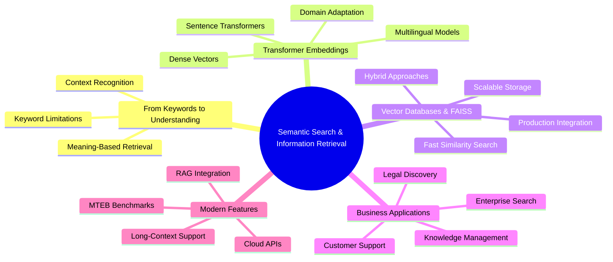
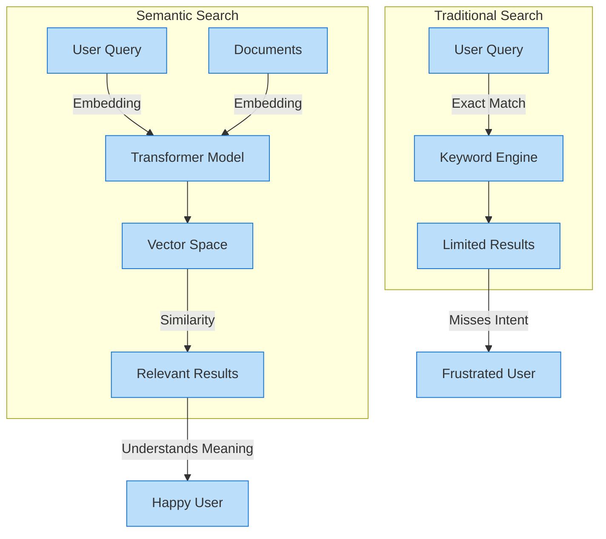
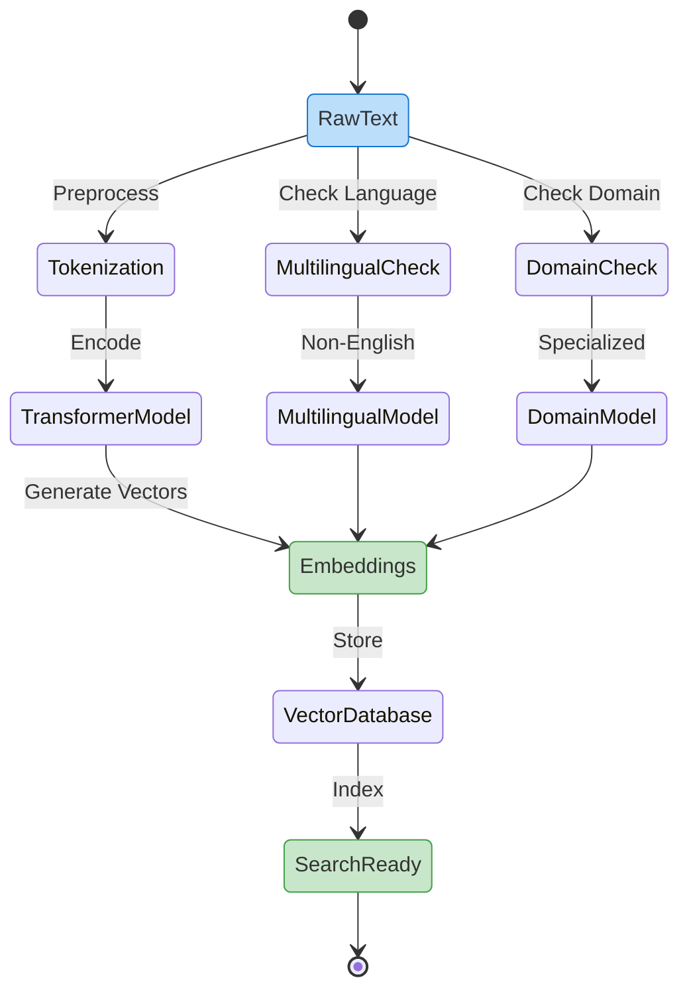
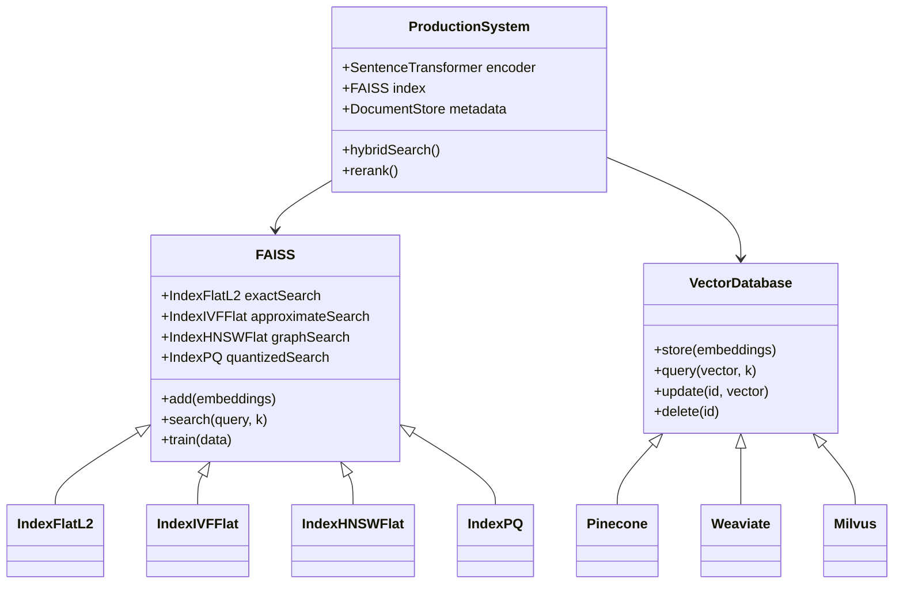
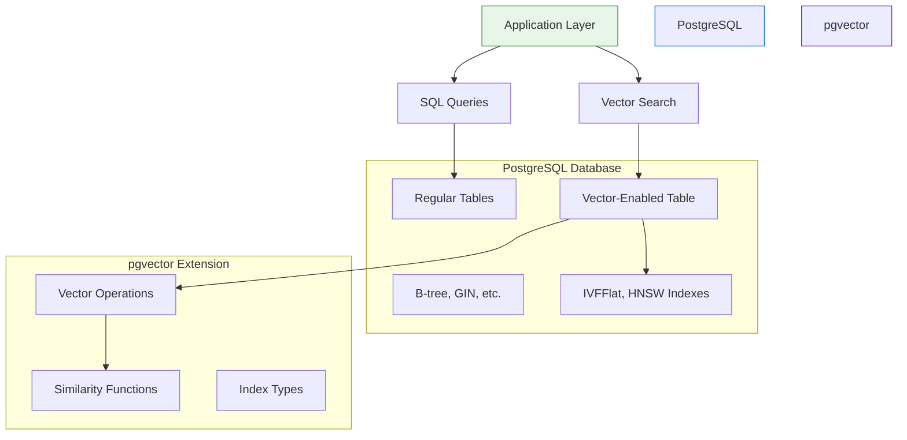

# Article 9 - Semantic Search and Information Retrieval with Transformers

# From Keywords to Neural Understanding: The Transformer Revolution in Search

Modern information retrieval has undergone a profound transformation. Where once we struggled with keyword limitations and boolean operators, today's semantic search unlocks the true meaning behind our questions. This chapter explores how transformer models have revolutionized search by bridging the gap between what users ask and what they truly seek.

We'll journey through:

- The **fundamental shift** from lexical matching to semantic understanding
- How **transformer architectures** create rich, contextual embeddings that capture meaning
- **Vector databases** that make these embeddings searchable at scale
- **Real-world applications** across customer support, knowledge management, and legal discovery
- The **latest advancements** including RAG integration and specialized domain models

By understanding both the theory and practical implementation of transformer-based search, you'll gain the tools to build systems that truly comprehend user intent—not just match strings. Let's explore how these neural networks have fundamentally changed what's possible in information retrieval.

# Semantic Search and Information Retrieval with Transformers - Article 9



**Step-by-Step Explanation:**

- Root node focuses on **Semantic Search & Information Retrieval**
- Branch shows transition **From Keywords to Understanding** with limitations and benefits
- Branch covers **Transformer Embeddings** including models and adaptations
- Branch details **Vector Databases & FAISS** for scalable implementation
- Branch highlights **Business Applications** across industries
- Branch includes **Modern Features** like RAG and benchmarking

## Introduction: From Keyword Search to True Understanding

Ever chased a critical document that you *know* exists, but can't find because you're using the wrong words? That's keyword search failing you. Today's transformer models transform this frustration into fluid discovery. They understand **meaning**, not just matching letters.

Picture searching a massive warehouse for a red umbrella. Keyword search gives you a flashlight that only illuminates boxes labeled "red." Miss the one marked "crimson parasol"? Too bad. You'll walk right past it.

Now imagine a brilliant assistant who grasps that crimson equals red, and parasol means umbrella. They understand your **intent**, not just your words. That's semantic search—it discovers meaning, not just matches.

**Semantic search** harnesses transformer models—deep learning architectures that capture relationships between words in context. Instead of literal matching, transformers encode the essence behind text. "Refund policy" and "money back guarantee" become neighbors in meaning space, even sharing zero words.

Let's witness this transformation with Python. We'll contrast keyword and semantic search using the latest `sentence-transformers` library and production-ready patterns.

This builds on my previous exploration of custom data workflows in [Custom Data Workflows Matter—Article 8](https://medium.com/@richardhightower/custom-data-workflows-matter-article-8-8d6e5ece9f2a), and for foundational transformer mechanics, see my blog post [Inside the Transformer: Architecture and Attention Demystified - A Complete Guide](https://cloudurable.com/blog/article-4-inside-the-transformer-architecture-and/).

### Setting Up Your Environment with Python 3.12.9

```bash
# Using pyenv (recommended for Python version management)
pyenv install 3.12.9
pyenv local 3.12.9

# Verify Python version
python --version  # Should show Python 3.12.9

# Install required packages with poetry
poetry new semantic-search-project
cd semantic-search-project
poetry env use 3.12.9
poetry add sentence-transformers numpy faiss-cpu rank-bm25 chromadb openai

# Or use mini-conda
conda create -n semantic-search python=3.12.9
conda activate semantic-search
pip install sentence-transformers numpy faiss-cpu rank-bm25 chromadb openai

# Or use pip with pyenv
pyenv install 3.12.9
pyenv local 3.12.9
pip install sentence-transformers numpy faiss-cpu rank-bm25 chromadb openai

```

### Keyword Search vs. Semantic Search: A Modern Comparison

```python
# Example FAQ documents
faqs = [
    "How can I reset my password?",
    "What are the steps for account recovery?",
    "How do I request a refund?",
    "Information about our privacy policy."
]

# User query
query = "I forgot my login credentials"

# --- Keyword Search ---
# Find FAQs containing any keyword from the query (exact match)
keywords = set(query.lower().split())
keyword_matches = [faq for faq in faqs if keywords & set(faq.lower().split())]
print("Keyword Search Results:", keyword_matches)

# --- Semantic Search ---
# Use a transformer model to embed both the FAQs and the query
from sentence_transformers import SentenceTransformer, util
import numpy as np

model = SentenceTransformer('all-MiniLM-L6-v2')  # Current, lightweight model

faq_embeddings = model.encode(faqs, convert_to_numpy=True)  # Embeddings as vectors
query_embedding = model.encode([query], convert_to_numpy=True)[0]

# Cosine similarity measures semantic closeness between query and each FAQ
cosine_scores = util.cos_sim(query_embedding, faq_embeddings)[0].cpu().numpy()

# Rank FAQs by similarity (highest score first)
top_idx = np.argsort(-cosine_scores)
semantic_matches = [faqs[i] for i in top_idx[:2]]
print("Semantic Search Results:", semantic_matches)

# Note: For production-scale search, use a vector database (see below) for efficiency.

```

**Step-by-Step Explanation:**

1. **Define FAQs and Query**: Create sample documents and a user question that doesn't match keywords exactly
2. **Keyword Search**: Split query into words, find FAQs sharing any word—misses relevant answers when wording differs
3. **Load Transformer Model**: Initialize sentence transformer that creates meaning-rich embeddings
4. **Generate Embeddings**: Convert FAQs and query into dense vectors capturing semantic essence
5. **Calculate Similarity**: Use cosine similarity to measure meaning closeness between vectors
6. **Rank Results**: Sort FAQs by similarity score—most relevant surfaces first

Notice how keyword search returns nothing (no shared words), while semantic search correctly identifies password/account recovery FAQs as relevant. That's the power of understanding **meaning**.

Why does this transformation matter for business?

- **Customer Support**: Users rarely phrase questions matching your documentation. Semantic search bridges this gap
- **Enterprise Knowledge**: Employees discover procedures using their own terminology
- **Legal Compliance**: Lawyers surface relevant precedents by meaning, not exact phrasing

Transformers fuel this leap. They absorb context and nuance from massive datasets, enabling search that transcends surface matching.

**Key takeaway**: Semantic search, powered by transformers, unlocks genuine language understanding. This shift proves vital for building smarter, more intuitive search across domains.

🔎 **Production Note:** Real-world semantic search stores embeddings in vector databases (FAISS, Milvus, Weaviate) for efficient scaling to millions of documents. We'll explore this shortly.

🌐 **Looking Ahead:** Recent advances include retrieval-augmented generation (RAG), Mixture of Experts architectures, and multimodal search combining text, images, and video. For a deeper dive into RAG's evolution and why it's far from dead, check my analysis in [Is RAG Dead? Anthropic Says No](https://medium.com/@richardhightower/is-rag-dead-anthropic-says-no-may-28-2025). Complement this with my blog on multimodal extensions in [Beyond Language: Transformers for Vision, Audio, and Multimodal AI - Article 7](https://cloudurable.com/blog/article-7-beyond-language-transformers-for-vision/), which explores how semantic search evolves beyond text.

## Introduction to Semantic Search

Search drives how we navigate information—from company wikis to legal archives. Traditional engines focus on exact matches, missing true intent. Semantic search revolutionizes this by understanding **meaning and context**, leveraging transformer embeddings.

You'll master how semantic search surpasses keyword matching, why transformer embeddings excel at capturing meaning, and which metrics prove search quality. We'll introduce production practices—vector databases, hybrid search, modern evaluation tools—through practical examples.



**Step-by-Step Explanation:**

- **Traditional Search** path shows query going through keyword engine to limited results
- User becomes frustrated when intent is missed
- **Semantic Search** path shows both query and documents becoming embeddings
- Transformer creates vectors that capture meaning
- Similarity matching produces relevant results
- User achieves satisfaction through understood intent

### Keyword vs. Semantic Search

Picture searching for "resetting your password." Keyword search only finds documents containing "reset" and "password"—missing "Account recovery steps" despite being your answer.

Think of keyword search as a rigid librarian who only fetches books with your exact phrase. Fast, but inflexible. Synonyms or paraphrasing derail it completely.

Semantic search resembles an insightful librarian who grasps your meaning. It connects "resetting password" with "account recovery" by matching **intent**, not letters. This magic happens through embeddings—numeric vectors representing text meaning, generated by transformers.

Embeddings capture context and word relationships. We compare meanings using **cosine similarity**—a mathematical measure of vector direction closeness. Nearby vectors share similar meaning.

### Comparing Keyword and Semantic Search Results

```python
# Ensure Python 3.12.9 environment
import sys
print(f"Python version: {sys.version}")  # Verify 3.12.9

# Example query and candidate documents
query = "How do I reset my password?"
documents = [
    "Account recovery steps",
    "Password reset instructions",
    "Update your profile information"
]

# Keyword search: match if 'password' is present
keyword_matches = [doc for doc in documents if "password" in doc.lower()]
print("Keyword Search Results:", keyword_matches)

# Semantic search: use a sentence transformer for meaning
from sentence_transformers import SentenceTransformer, util
# You can also try newer embedding models, such as 'BAAI/bge-base-en-v1.5' or 'intfloat/e5-base-v2'
model = SentenceTransformer('all-MiniLM-L6-v2')
query_embedding = model.encode(query)
doc_embeddings = model.encode(documents)
scores = util.cos_sim(query_embedding, doc_embeddings)[0]
top_idx = scores.argmax().item()
print("Semantic Search Top Result:", documents[top_idx])

```

**Step-by-Step Explanation:**

1. **Verify Python Version**: Ensure we're using Python 3.12.9 for consistency
2. **Define Query and Documents**: Create search scenario with varied phrasings
3. **Keyword Search**: Only finds "Password reset instructions"—ignores relevant "Account recovery"
4. **Load Transformer**: Initialize model that creates semantic embeddings
5. **Generate Embeddings**: Convert text into meaning vectors
6. **Calculate Similarity**: Find document with closest meaning to query
7. **Surface Best Match**: Semantic search correctly identifies most relevant document

Try modifying the query to "forgot login details"—watch how results shift. This demonstrates semantic search uncovering relevance that keyword search misses entirely.

Production systems scale by storing embeddings in vector databases (FAISS, Milvus, Pinecone, Weaviate), enabling lightning-fast similarity search across millions of documents.

Modern engines combine keyword and semantic search (hybrid search) maximizing precision and recall. Reranking models (cross-encoders, LLMs) further refine top results.

**Key Takeaway:** Semantic search matches meaning, not just words. Transformer embeddings plus vector databases deliver helpful, scalable, accurate results.

### Hybrid Search: Combining Keyword and Semantic Approaches

After discussing keyword vs. semantic search, let's explore how to combine both approaches for optimal results. Hybrid search leverages the precision of keyword matching with the understanding of semantic search.

```python
from rank_bm25 import BM25Okapi
from sentence_transformers import SentenceTransformer, util
import numpy as np

# Documents and query
documents = ["Account recovery steps", "Password reset instructions", "Update profile"]
query = "Forgot login details"

# Keyword component (BM25)
tokenized_docs = [doc.lower().split() for doc in documents]
bm25 = BM25Okapi(tokenized_docs)
bm25_scores = bm25.get_scores(query.lower().split())

# Semantic component
model = SentenceTransformer('all-MiniLM-L6-v2')
query_emb = model.encode(query)
doc_embs = model.encode(documents)
semantic_scores = util.cos_sim(query_emb, doc_embs)[0].numpy()

# Hybrid: Weighted average (e.g., 0.4 keyword + 0.6 semantic)
hybrid_scores = 0.4 * np.array(bm25_scores) + 0.6 * semantic_scores
top_idx = np.argsort(-hybrid_scores)[0]
print("Hybrid Top Result:", documents[top_idx])
```

**Step-by-Step Explanation:**

1. **Tokenize documents for BM25**: Split documents into words for keyword scoring
2. **Compute keyword scores**: Use BM25 algorithm for traditional relevance
3. **Generate embeddings for semantic scores**: Create meaning-based vectors
4. **Combine with weights**: Balance keyword precision with semantic understanding (tune based on domain)
5. **Rank results**: Surface the best match using combined scores

This hybrid approach often outperforms either method alone, especially in domains where specific terminology matters but users may phrase queries differently.

### Business Applications of Semantic Search

Semantic search isn't merely technical evolution—it's competitive advantage. Real-world impact:

1. **Enterprise Knowledge Bases:** Employees use varied terminology. Semantic search bridges vocabulary gaps, surfacing answers regardless of phrasing.
2. **Customer Support Automation:** Intent-aware chatbots understand "How can I get my money back?" matches refund policies—without the word "refund."
3. **Legal and Compliance Discovery:** Legal teams find relevant precedents through meaning, not just keywords—saving hours, reducing risk. This aligns with enterprise use cases I've covered in [The Economics of Deploying Large Language Models: Costs, Value, and 99.7% Savings](https://medium.com/@richardhightower/the-economics-of-deploying-large-language-models-costs-value-and-99-7-savings-jul-3-2025), and for scaling such systems, refer to my blog post [Scaling Up: Debugging, Optimization, and Distributed Training - Article 17](https://cloudurable.com/blog/scaling-up-debugging-optimization-a/).

Production deployments leverage scalable vector databases for efficient embedding retrieval, often combining keyword and semantic methods for peak accuracy.

**Summary:** Semantic search reduces friction, boosts satisfaction, makes knowledge work efficient—especially with cutting-edge embedding models and infrastructure.

### Vector Database Comparison Table

| Database | Type | Strengths | Best For | Scaling |
| --- | --- | --- | --- | --- |
| **FAISS** | Open-source library | Fast, flexible indices | Research, custom deployments | Manual sharding |
| **PostgreSQL + pgvector** | Extension | ACID, SQL integration, mature | Enterprise with existing PG | Vertical + read replicas |
| **Pinecone** | Managed cloud | Zero-ops, auto-scaling | SaaS applications | Automatic |
| **Weaviate** | Open-source + cloud | GraphQL API, hybrid search | Enterprise search | Horizontal |
| **Milvus** | Open-source + cloud | GPU support, high performance | Large-scale ML | Distributed |
| **Qdrant** | Open-source + cloud | Rust-based, filtering | Real-time applications | Cloud-native |
| **Chroma** | Embedded/cloud | Simple API, developer-friendly | Prototyping, RAG | In-memory to cloud |

### Measuring Search Quality: Metrics that Matter

Building search is half the battle. Proving it works requires clear metrics:

1. **Precision:** What fraction of results are relevant? High precision minimizes irrelevant noise.
2. **Recall:** What fraction of relevant documents appeared? High recall ensures nothing important is missed.
3. **F1 Score:** Harmonizes precision and recall into one balanced metric.
4. **Mean Reciprocal Rank (MRR):** How high does the first relevant result appear? Top placement delights users.
5. **Normalized Discounted Cumulative Gain (NDCG):** Evaluates entire ranking, rewarding relevant results near the top—crucial for result lists.

### Calculating Precision and Recall for Search Results

```python
# Example: Evaluating a search system
retrieved = {"doc1", "doc2", "doc5"}  # IDs of documents returned by search
relevant = {"doc2", "doc3", "doc5"}   # IDs of truly relevant documents

precision = len(retrieved & relevant) / len(retrieved)
recall = len(retrieved & relevant) / len(relevant)
print(f"Precision: {precision:.2f}")
print(f"Recall: {recall:.2f}")
# Output: Precision: 0.67, Recall: 0.67

```

**Step-by-Step Explanation:**

1. **Define Sets**: Retrieved documents vs. truly relevant documents
2. **Calculate Intersection**: Find documents that are both retrieved and relevant
3. **Compute Precision**: Fraction of retrieved that are relevant
4. **Compute Recall**: Fraction of relevant that were retrieved

Practice requires averaging metrics across many queries. For ranking metrics (MRR, NDCG), libraries like Hugging Face's `evaluate`, `scikit-learn`, or `pytrec_eval` automate calculations.

Choose metrics matching your goals. Customer support needs high recall—never miss helpful articles. Legal search demands high precision—avoid irrelevant results.

**Key Point:** Metrics transform search quality from guesswork into measurable outcomes, guiding continuous improvement.

## Embedding Text for Search Applications

Imagine organizing a vast library by **meaning**, not titles. That's semantic search's challenge—embeddings solve it. You'll learn to transform text into vectors, store them efficiently, adapt for languages and specialized domains. We'll highlight cutting-edge models and databases for future-proof, production-ready solutions.



**Step-by-Step Explanation:**

- Start with **RawText** that needs embedding
- Text goes through **Tokenization** preprocessing
- **TransformerModel** encodes tokens into **Embeddings**
- Embeddings stored in **VectorDatabase** and indexed
- System becomes **SearchReady**
- Parallel paths handle **Multilingual** and **Domain-specific** content

Coverage includes:

1. What embeddings are and their importance
2. Creating them with sentence transformers and modern APIs
3. Storing and managing embeddings at scale
4. Multilingual and domain-specific strategies
5. Selecting optimal models and databases

### What Are Embeddings—and Why Do They Matter?

An embedding is a numerical fingerprint—a vector—capturing text meaning. Picture it as DNA for sentences. Similar meanings yield similar embeddings, clustering in vector space.

Consider:

- "How do I reset my password?"
- "What are the steps to recover my account?"

Keyword search sees these as unrelated. Embeddings recognize their semantic kinship, enabling intelligent matching.

Practical impact? Embeddings power:

- Customer question routing to relevant help articles—despite different wording
- Support ticket clustering by issue type
- Cross-language search focusing on meaning
- Retrieval-augmented generation (RAG) combining search with LLMs for reasoning

I've explored practical RAG implementations in [Beyond Chat: Enhancing LiteLLM Multi-Provider App with RAG, Streaming, and AWS Bedrock](https://medium.com/@richardhightower/beyond-chat-enhancing-litellm-multi-provider-app-with-rag-streaming-and-aws-bedrock-may-20-2025). For the foundational step of tokenization that underpins embeddings, see my blog post [Article 5: Tokenization - Converting Text to Numbers for Neural Networks](https://cloudurable.com/blog/article-5-tokenization-converting-text-to-number/).

**Bottom line**: Embeddings translate language into comparable meanings, not just matched strings.

### Generating Embeddings with Sentence Transformers and Modern APIs

While classic transformers like BERT understand language, they weren't designed for sentence comparison. **Sentence transformers** train specifically to cluster similar meanings—perfect for search. Recent APIs (Google Gemini, OpenAI, Cohere) raise the bar for multilingual and domain performance.

The `sentence-transformers` library remains essential for local workflows. For English, `'all-MiniLM-L6-v2'` delivers speed and accuracy. Production deployments often use cloud APIs or cutting-edge open models. **Pro tip:** Check the [MTEB leaderboard](https://huggingface.co/spaces/mteb/leaderboard) for latest benchmarks.

### Generating Embeddings with Sentence Transformers

```python
from sentence_transformers import SentenceTransformer

# Load a pre-trained sentence transformer model
model = SentenceTransformer('all-MiniLM-L6-v2')

# Example sentences to embed
sentences = [
    "How do I reset my password?",
    "Account recovery steps"
]

# Generate embeddings (returns a NumPy array of floats)
embeddings = model.encode(sentences)

print(embeddings.shape)  # Output: (2, 384)

```

**Step-by-Step Explanation:**

1. **Import Library**: Load sentence-transformers for embedding generation
2. **Load Model**: Initialize pre-trained model from Hugging Face
3. **Define Sentences**: Create text samples to embed
4. **Generate Embeddings**: Convert sentences to 384-dimensional vectors
5. **Verify Shape**: Confirm output dimensions match expectations

Similar sentences produce similar vectors, enabling meaningful comparison. For other languages or industries, choose models trained on relevant data. Modern APIs support longer sequences—essential for document search and RAG.

For state-of-the-art performance, explore Google Gemini Embedding, OpenAI's latest APIs, or top MTEB models supporting extended inputs, superior accuracy, and broader language coverage.

### Modern Embedding API Example with OpenAI

```python
# Example using OpenAI's embedding API (requires API key)
import openai
import numpy as np

# Set your OpenAI API key
openai.api_key = "your-api-key-here"

def get_openai_embeddings(texts):
    """Generate embeddings using OpenAI's latest text-embedding model"""
    response = openai.Embedding.create(
        model="text-embedding-ada-002",  # Or newer models as available
        input=texts
    )
    embeddings = [item['embedding'] for item in response['data']]
    return np.array(embeddings)

# Example usage
texts = ["How do I reset my password?", "Account recovery steps"]
openai_embeddings = get_openai_embeddings(texts)
print(f"OpenAI embeddings shape: {openai_embeddings.shape}")  # (2, 1536)

# Compare with sentence-transformers for cost/performance trade-offs
# OpenAI: Higher accuracy, API costs, larger dimensions
# Sentence-transformers: Free, local, smaller dimensions

```

**Step-by-Step Explanation:**

1. **Import Libraries**: Load OpenAI client and NumPy
2. **Set API Key**: Configure authentication for OpenAI
3. **Define Function**: Create reusable embedding generator
4. **Call API**: Request embeddings from OpenAI's model
5. **Extract Vectors**: Parse response into NumPy array
6. **Compare Options**: Understand trade-offs between APIs and local models

### RAG: Combining Search with Generation

Since RAG (Retrieval-Augmented Generation) is increasingly important, let's see how embeddings feed into generative AI:

```python
from transformers import pipeline
from sentence_transformers import SentenceTransformer, util
import numpy as np

# Setup retriever (simple in-memory for demo)
model = SentenceTransformer('all-MiniLM-L6-v2')
docs = ["Refund policy: 30 days money back.", "Account recovery: Contact support."]
doc_embs = model.encode(docs)

# Query
query = "How do I get a refund?"
query_emb = model.encode(query)
scores = util.cos_sim(query_emb, doc_embs)[0].numpy()
top_doc = docs[np.argmax(scores)]

# RAG: Use retrieved doc as context for LLM
generator = pipeline('text-generation', model='gpt2')  # Replace with fine-tuned model in production
prompt = f"Context: {top_doc}\nQuestion: {query}\nAnswer:"
response = generator(prompt, max_length=50)[0]['generated_text']
print("RAG Response:", response)
```

**Step-by-Step Explanation:**

1. **Embed documents and query**: Create vectors for similarity search
2. **Retrieve top match via cosine similarity**: Find most relevant document
3. **Craft prompt with context**: Combine retrieved information with question
4. **Generate response**: Use LLM to produce contextual answer

Note: Use larger models like Llama-2 or GPT-4 for better production results. This demonstrates how semantic search enables more accurate, grounded AI responses.

### Batch Processing and Storing Embeddings

Real systems handle thousands of documents—product catalogs, support tickets, articles. Batch processing accelerates embedding creation. You'll need persistent storage for search. **Vector databases** are now industry standard for production.

### Batch Embedding and Saving to Disk

```python
import numpy as np

# Example: List of document texts
documents = ["Doc 1 text", "Doc 2 text", "Doc 3 text"]

# Batch encode documents (adjust batch_size for your hardware)
doc_embeddings = model.encode(documents, batch_size=32, show_progress_bar=True)

# Save embeddings as a NumPy array for later use
np.save('doc_embeddings.npy', doc_embeddings)

```

**Step-by-Step Explanation:**

1. **Prepare Documents**: Create list of texts to embed
2. **Batch Encode**: Process multiple documents efficiently
3. **Show Progress**: Track encoding progress for large batches
4. **Save Embeddings**: Store vectors in NumPy format for fast loading

⚡ **Pro Tip:** Always maintain document ID mapping. Track which embedding corresponds to which document—critical for retrieving correct text later.

For production search, choose vector databases like FAISS, Qdrant, Milvus, or Chroma—optimized for embedding storage and similarity search at scale.

**Summary**: Batch processing and organized storage enable scalable semantic search. Select databases matching your performance and deployment needs.

### Multilingual and Domain-Specific Embeddings

Global businesses operate across languages and specialized fields. How do embeddings capture meaning across these dimensions? Recent advances dramatically improve multilingual and domain performance.

**Multilingual embeddings:**
Models like `'paraphrase-multilingual-MiniLM-L12-v2'` support 50+ languages. Google Gemini and OpenAI embeddings offer even broader coverage. Similar meanings cluster together regardless of language.

### Generating Multilingual Embeddings

```python
multi_model = SentenceTransformer('paraphrase-multilingual-MiniLM-L12-v2')

sentences = [
    "How do I reset my password?",        # English
    "¿Cómo puedo restablecer mi contraseña?",  # Spanish
    "Comment réinitialiser mon mot de passe?"  # French
]

multi_embeddings = multi_model.encode(sentences)
print(multi_embeddings.shape)  # Output: (3, 384)

```

**Step-by-Step Explanation:**

1. **Load Multilingual Model**: Initialize model supporting multiple languages
2. **Define Multilingual Sentences**: Same meaning in three languages
3. **Generate Embeddings**: Create vectors capturing cross-language meaning
4. **Verify Consistency**: All produce same-dimension embeddings

These three sentences share meaning—multilingual models ensure their embeddings cluster together, enabling seamless cross-language search.

**Domain-specific embeddings:**
Technical fields need specialized understanding. Options:

- Search Hugging Face for domain models (legal, biomedical, financial)
- Fine-tune base models on your data (see Article 10)
- Use APIs with strong domain-specific MTEB performance

**Long-context support:**
Modern embeddings (Gemini, OpenAI) handle extended sequences—ideal for document search and RAG applications requiring large context.

**In summary:**

- Deploy multilingual models for global reach
- Adapt models for specialized domains
- Prefer long-context support for documents
- Benchmark using MTEB for optimal selection

Right model choice boosts search quality and user satisfaction dramatically.

### Key Takeaways and Next Steps

Embeddings transform text into semantic vectors, enabling meaning-based search. Sentence transformers and modern APIs simplify generation and storage at scale. Match models to your language, domain, and context needs using MTEB benchmarks.

Building on this, my guide [The Developer's Guide to AI File Processing with AutoRAG support: Claude vs. Bedrock vs. OpenAI](https://medium.com/@richardhightower/the-developers-guide-to-ai-file-processing-with-autorag-support-claude-vs-bedrock-vs-openai-may-29-2025) compares RAG implementations across providers. For customizing models via fine-tuning, which enhances domain-specific embeddings, check my blog [Mastering Fine-Tuning: Transforming General Models into Domain Specialists - Article 10](https://cloudurable.com/blog/advanced-fine-tuning-chat-templates/).

**Try this**: Embed three sentences from your domain. Compare their vectors—notice meaning clusters. For production, experiment with Qdrant, Milvus, or Chroma for managed search.

**Next**: Discover how embeddings power real search with vector databases and FAISS (this chapter). Explore fine-tuning for custom needs (Article 10). For advanced applications, embeddings enable RAG systems combining search with LLM reasoning.

## Vector Databases and FAISS Integration

Semantic search retrieves **meaning** across massive datasets. FAISS (Facebook AI Similarity Search) delivers high-performance, open-source vector search and clustering. Scale from thousands to billions of records while maintaining low latency. You'll install FAISS, build indices, and apply production best practices for scaling. We'll cover recent features, quantization, and integration with distributed search.



**Step-by-Step Explanation:**

- **FAISS** base class provides vector search functionality
- Subclasses offer different index types for various use cases
- **VectorDatabase** interface implemented by managed solutions
- **ProductionSystem** integrates FAISS with transformers and metadata
- Shows relationships between components in real deployments

### Setting Up FAISS for Scalable Similarity Search

FAISS excels at similarity search over high-dimensional vectors from transformers. It supports exact search (true nearest neighbors) and approximate search (faster with minor accuracy trade-offs). Version 1.7.2+ adds improved GPU support and enhanced algorithms.

Install FAISS choosing CPU or GPU versions based on your hardware. Ensure Python 3.7+ and NumPy 1.18+ compatibility.

### Installing and Importing FAISS (v1.7.2+)

```python
# Using Python 3.12.9 environment
# Install FAISS for CPU
# pip install faiss-cpu
# Or for GPU (CUDA)
# pip install faiss-gpu

# Or with poetry (recommended)
# poetry add faiss-cpu

# Or with conda
# conda install -c pytorch faiss-cpu

import faiss
import numpy as np

print(f"FAISS version: {faiss.__version__}")  # Should be 1.7.2 or higher
print(f"Python version: {sys.version}")  # Verify 3.12.9

```

FAISS requires embeddings as NumPy arrays with dtype 'float32'. Convert other types before indexing to prevent errors.

### Ensuring Embedding Data Type Compatibility

```python
embeddings = np.array(embeddings, dtype=np.float32)  # Always use float32

```

Create your first FAISS index—a data structure enabling fast similarity search. For small-medium datasets, exact search works perfectly.

### Creating a Simple FAISS Index (Exact Search)

```python
# Assume 'embeddings' is a (num_vectors, dimension) float32 array
dimension = embeddings.shape[1]  # Embedding size
index = faiss.IndexFlatL2(dimension)  # Exact search with L2 distance
index.add(embeddings)  # Add embeddings to index

```

**Step-by-Step Explanation:**

1. **Get Dimension**: Extract embedding vector length (e.g., 384)
2. **Create Index**: Initialize exact L2 distance index
3. **Add Data**: Load embeddings for fast searching

For larger datasets, explore approximate or compressed indices (covered in scaling section).

### Indexing, Querying, and Updating Search Indices

With your index built, search for similar items by embedding queries and using FAISS's search API. Always use the same model and preprocessing for queries as your indexed data.

Process:

1. Generate query embedding (same model as documents)
2. Search FAISS index for nearest neighbors
3. Map results to original data

### Performing a Search Query with Error Handling

```python
try:
    query_text = "How can I get my money back?"
    query_embedding = model.encode([query_text]).astype(np.float32)
    # Ensure shape is (1, dimension)
    if query_embedding.ndim == 1:
        query_embedding = query_embedding.reshape(1, -1)
    distances, indices = index.search(query_embedding, k=3)  # Top-3 matches
    print("Top 3 matching document indices:", indices[0])
    print("Corresponding distances:", distances[0])
except Exception as e:
    print(f"An error occurred during FAISS search: {e}")

```

**Step-by-Step Explanation:**

1. **Define Query**: User's search question
2. **Generate Embedding**: Convert query to vector using same model
3. **Reshape if Needed**: Ensure proper dimensions for FAISS
4. **Search Index**: Find top-k most similar embeddings
5. **Handle Errors**: Gracefully manage potential issues
6. **Display Results**: Show matching indices and distances

Lower distance indicates higher similarity for L2 distance metric.

Adding new documents: generate embeddings and use `index.add()`. Most indices support fast, safe addition. Note: Training-required indices (IVF) need training before adding data.

Deletion/updates are complex. Version 1.7.2 supports limited deletion (IndexIVFFlat with IDMap). Best practice: periodically rebuild indices for frequent changes.

Always save indices after major updates for reliability and fast recovery.

### Saving and Loading a FAISS Index (v1.7.2+)

```python
# Save the index
faiss.write_index(index, "my_faiss.index")

# Load it later
index = faiss.read_index("my_faiss.index")

```

Production tip: Version indices and store in durable locations (object storage, distributed filesystems) for disaster recovery.

### Managed Vector DB Example with Chroma

To complement FAISS with a cloud-managed alternative, here's how to use Chroma for simpler deployment:

```python
from chromadb import Client
from sentence_transformers import SentenceTransformer

# Setup Chroma client
client = Client()
collection = client.create_collection("docs")

# Embed and upsert documents
model = SentenceTransformer('all-MiniLM-L6-v2')
docs = ["Doc1 text", "Doc2 text"]
embeddings = model.encode(docs).tolist()
collection.add(ids=["1", "2"], embeddings=embeddings, documents=docs)

# Query
query_emb = model.encode(["Similar query"]).tolist()
results = collection.query(query_embeddings=query_emb, n_results=1)
print("Top Match:", results['documents'][0][0])
```

**Step-by-Step Explanation:**

1. **Initialize client and collection**: Set up Chroma database connection
2. **Generate embeddings**: Create vectors for documents
3. **Upsert with IDs**: Store documents with unique identifiers
4. **Query and retrieve**: Find similar documents efficiently

This managed approach simplifies deployment while FAISS offers more control for custom solutions.

### Scaling Semantic Search

Growing datasets make exact search (`IndexFlatL2`) slow or memory-intensive. FAISS offers advanced scaling strategies: approximate nearest neighbor (ANN) search, quantization, GPU acceleration. Version 1.7.2+ adds LSQ quantization on GPU and improved clustering.

1. **Approximate Nearest Neighbor (ANN) Search**

ANN algorithms dramatically accelerate search by returning close (not always exact) matches. FAISS options:

- `IndexIVFFlat`: Inverted File with Flat quantization (requires training)
- `IndexHNSWFlat`: Hierarchical Navigable Small World graphs (no training, fast)
- `IndexLSQ`: Locally Sensitive Quantization (GPU support in v1.7.2)
- `IndexPQ`: Product Quantization for compression

Choose based on dataset size, accuracy needs, and hardware.

### Building an Approximate Search Index with FAISS (IVF)

```python
# Set up an IVF index for large-scale search
nlist = 100  # Number of clusters (tune for your data)
quantizer = faiss.IndexFlatL2(dimension)  # Used for cluster assignment
index_ivf = faiss.IndexIVFFlat(quantizer, dimension, nlist, faiss.METRIC_L2)

# Must train the index before adding data
index_ivf.train(embeddings)
index_ivf.add(embeddings)

# Enable parallel search for faster queries (optional, multi-core CPUs)
faiss.omp_set_num_threads(4)

```

**Step-by-Step Explanation:**

1. **Define Clusters**: Set number of partitions for vector space
2. **Create Quantizer**: Initialize cluster assignment mechanism
3. **Build IVF Index**: Combine quantizer with inverted file structure
4. **Train Index**: Learn cluster centers from data
5. **Add Data**: Insert embeddings into trained index
6. **Enable Parallelism**: Use multiple CPU cores for faster search

`IndexIVFFlat` partitions space into clusters for faster search. Training required before data addition. `nlist` balances speed vs. recall.

1. **Quantization and Compression**

For massive datasets, quantization reduces memory with minimal accuracy loss. FAISS supports Product Quantization (PQ) and LSQ (including GPU).

### Building a Memory-Efficient Index with Product Quantization

```python
# Example: IVF with Product Quantization
nlist = 100
m = 8  # Number of subquantizers (tune for your dimension)
nbits = 8  # Bits per quantizer
quantizer = faiss.IndexFlatL2(dimension)
index_ivfpq = faiss.IndexIVFPQ(quantizer, dimension, nlist, m, nbits)

index_ivfpq.train(embeddings)
index_ivfpq.add(embeddings)

```

Quantization enables billion-scale search on single servers or GPUs through dramatic memory reduction.

1. **Sharding and Distributed Search**

Massive datasets require splitting across machines (sharding). Each shard handles partial data; results merge at query time. While FAISS lacks native multi-node orchestration, it integrates with distributed databases like Pinecone, Weaviate, or Milvus.

1. **Hybrid Search: Semantic + Keyword**

Modern search combines vectors (semantic) with keywords (e.g., Elasticsearch). Common pattern: keyword filtering, then FAISS ranking. This hybrid maximizes precision and recall.

1. **Integrating FAISS with Hugging Face Datasets**

Hugging Face Datasets offers built-in FAISS integration—add indices to embedding columns for seamless search.

### Integrating FAISS with Hugging Face Datasets

```python
from datasets import Dataset
import numpy as np

# Assume 'texts' (list of strings) and 'embeddings' (NumPy array) are defined
hf_dataset = Dataset.from_dict({'text': texts, 'embeddings': list(embeddings)})

# Add a FAISS index to the 'embeddings' column
hf_dataset.add_faiss_index(column='embeddings')

query_embedding = model.encode(["How can I get my money back?"]).astype(np.float32)
scores, retrieved_examples = hf_dataset.get_nearest_examples(
    'embeddings', query_embedding, k=3
)

for idx, (score, example) in enumerate(zip(scores, retrieved_examples['text'])):
    print(f"Rank {idx+1}: {example} (Score: {score})")

```

**Step-by-Step Explanation:**

1. **Create Dataset**: Combine texts with their embeddings
2. **Add FAISS Index**: Enable fast search on embedding column
3. **Query Dataset**: Search for similar documents
4. **Retrieve Results**: Get nearest examples with scores
5. **Display Ranked Results**: Show top matches with similarity scores

This integration streamlines experimentation and production deployment within the Hugging Face ecosystem.

**Summary**: Scaling semantic search requires more than speed—it demands reliable, relevant results at any scale. Choose appropriate FAISS indices, leverage quantization, integrate with distributed and hybrid tools for enterprise-grade systems.

**Key Points:**

- Use FAISS v1.7.2+ for scalable vector search with latest features
- Select exact or approximate indices based on size and latency needs
- Apply quantization for memory efficiency on large datasets
- Save and version indices for reliability
- Integrate with distributed or hybrid search as needed

## PostgreSQL with pgvector: Enterprise-Ready Vector Search

While FAISS excels at pure vector operations, many enterprises need vector search integrated with their existing databases. PostgreSQL with pgvector extension delivers production-grade vector similarity search alongside ACID transactions, SQL queries, and mature tooling. This section explores pgvector's capabilities, performance characteristics, and integration patterns for semantic search at scale.



**Step-by-Step Explanation:**

- **Application Layer** sends both traditional SQL and vector search queries
- **PostgreSQL Database** contains regular tables and vector-enabled tables
- **pgvector Extension** provides vector operations and specialized indexes
- **Vector Indexes** (IVFFlat, HNSW) accelerate similarity search
- Integration allows joining vector results with relational data

### Why PostgreSQL for Vector Search?

PostgreSQL with pgvector combines the best of both worlds:

1. **ACID Compliance**: Full transactional guarantees for vector operations
2. **SQL Integration**: JOIN vector search results with existing data
3. **Mature Ecosystem**: Leverage PostgreSQL's tooling, monitoring, backups
4. **Hybrid Queries**: Combine semantic search with filters, aggregations
5. **Cost Efficiency**: Use existing PostgreSQL infrastructure

Perfect for organizations already using PostgreSQL who need vector capabilities without managing separate systems.

### Setting Up PostgreSQL with pgvector

First, install PostgreSQL with pgvector extension. We'll use Docker for quick setup:

```bash
# Using Docker Compose (recommended for development)
docker-compose up -d postgres-vector

# Or direct Docker command
docker run -d \
  --name pgvector-demo \
  -e POSTGRES_PASSWORD=postgres \
  -p 5433:5432 \
  pgvector/pgvector:pg16

# Verify connection
psql -h localhost -p 5433 -U postgres -d postgres
```

### Creating Vector-Enabled Tables

```sql
-- Enable pgvector extension
CREATE EXTENSION IF NOT EXISTS vector;

-- Create a table for documents with embeddings
CREATE TABLE documents (
    id SERIAL PRIMARY KEY,
    content TEXT NOT NULL,
    embedding vector(384),  -- 384 dimensions for all-MiniLM-L6-v2
    metadata JSONB,
    created_at TIMESTAMP DEFAULT CURRENT_TIMESTAMP
);

-- Create index for fast similarity search
CREATE INDEX ON documents USING ivfflat (embedding vector_cosine_ops)
WITH (lists = 100);
```

**Step-by-Step Explanation:**

1. **Enable Extension**: Activate pgvector in your database
2. **Define Vector Column**: Specify dimensions matching your embedding model
3. **Add Metadata**: JSONB column for flexible additional data
4. **Create Index**: IVFFlat index for approximate nearest neighbor search
5. **Configure Lists**: Balance between speed and accuracy (more lists = better accuracy)

### Python Integration with pgvector

```python
import psycopg2
from pgvector.psycopg2 import register_vector
from sentence_transformers import SentenceTransformer
import numpy as np

# Connect to PostgreSQL
conn = psycopg2.connect(
    host="localhost",
    port="5433",
    database="vector_demo",
    user="postgres",
    password="postgres"
)

# Register pgvector type
register_vector(conn)
cursor = conn.cursor()

# Initialize embedding model
model = SentenceTransformer('all-MiniLM-L6-v2')

# Insert documents with embeddings
documents = [
    "PostgreSQL is a powerful relational database",
    "Vector search enables semantic similarity",
    "pgvector integrates seamlessly with SQL"
]

for doc in documents:
    embedding = model.encode(doc)
    cursor.execute(
        "INSERT INTO documents (content, embedding) VALUES (%s, %s)",
        (doc, embedding.tolist())
    )

conn.commit()

# Perform semantic search
query = "database with vector capabilities"
query_embedding = model.encode(query)

cursor.execute("""
    SELECT content, 1 - (embedding <=> %s) AS similarity
    FROM documents
    ORDER BY embedding <=> %s
    LIMIT 3
""", (query_embedding.tolist(), query_embedding.tolist()))

for row in cursor.fetchall():
    print(f"Content: {row[0]}")
    print(f"Similarity: {row[1]:.3f}\n")
```

**Step-by-Step Explanation:**

1. **Connect to Database**: Establish PostgreSQL connection
2. **Register Vector Type**: Enable pgvector operations in Python
3. **Generate Embeddings**: Use same model as FAISS examples
4. **Insert with Embeddings**: Store documents and vectors together
5. **Query with Similarity**: Use `<=>` operator for cosine distance
6. **Calculate Similarity Score**: Convert distance to similarity (1 - distance)

### Advanced pgvector Features

#### 1. Multiple Index Types

pgvector supports different index types for various use cases:

```sql
-- IVFFlat: Good balance of speed and accuracy
CREATE INDEX idx_ivfflat ON documents 
USING ivfflat (embedding vector_cosine_ops) 
WITH (lists = 100);

-- HNSW: Faster queries, more memory, better for static data
CREATE INDEX idx_hnsw ON documents 
USING hnsw (embedding vector_cosine_ops) 
WITH (m = 16, ef_construction = 64);

-- No index: Exact search for small datasets
-- Simply omit the CREATE INDEX statement
```

#### 2. Hybrid Search with Filters

Combine vector similarity with SQL conditions:

```sql
-- Find similar documents created in the last 7 days
SELECT content, 1 - (embedding <=> %s) AS similarity
FROM documents
WHERE created_at > NOW() - INTERVAL '7 days'
  AND metadata->>'category' = 'technical'
ORDER BY embedding <=> %s
LIMIT 5;
```

#### 3. Distance Functions

pgvector supports multiple distance metrics:

```sql
-- Cosine distance (default, normalized)
ORDER BY embedding <=> query_vector

-- Euclidean distance (L2)
ORDER BY embedding <-> query_vector

-- Inner product (for non-normalized vectors)
ORDER BY embedding <#> query_vector
```

### Performance Optimization

#### 1. Index Selection Strategy

```python
def choose_index_type(num_vectors, update_frequency):
    """Recommend pgvector index based on use case"""
    if num_vectors < 10_000:
        return "No index needed for small datasets"
    elif update_frequency == "high":
        return "IVFFlat - handles updates better"
    else:
        return "HNSW - fastest queries for static data"
```

#### 2. Batch Operations

```python
# Efficient batch insertion
def batch_insert_embeddings(documents, batch_size=100):
    embeddings = model.encode(documents, batch_size=32)
    
    # Use COPY for fastest insertion
    with cursor.copy(
        "COPY documents (content, embedding) FROM STDIN"
    ) as copy:
        for doc, emb in zip(documents, embeddings):
            copy.write_row([doc, emb.tolist()])
```

#### 3. Query Optimization

```sql
-- Optimize HNSW search performance
SET hnsw.ef_search = 100;  -- Higher = more accurate, slower

-- Limit search to top candidates first
WITH candidates AS (
    SELECT * FROM documents
    WHERE metadata->>'category' = 'target_category'
    LIMIT 1000
)
SELECT content, 1 - (embedding <=> %s) AS similarity
FROM candidates
ORDER BY embedding <=> %s
LIMIT 10;
```

### Comparing pgvector with FAISS

| Feature | FAISS | pgvector |
| --- | --- | --- |
| **Speed** | Fastest for pure vector ops | Good, with SQL overhead |
| **ACID Transactions** | No | Yes |
| **SQL Integration** | No | Native |
| **Maintenance** | Manual | PostgreSQL tools |
| **Scaling** | Sharding complexity | Read replicas, partitioning |
| **Memory Management** | Manual | PostgreSQL buffer management |
| **Index Types** | More options | IVFFlat, HNSW |
| **Updates** | Limited | Full CRUD support |

### Production Deployment Patterns

#### 1. Read Replica Pattern

```yaml
# docker-compose.yml excerpt
services:
  postgres-primary:
    image: pgvector/pgvector:pg16
    environment:
      POSTGRES_REPLICATION_MODE: master
      
  postgres-replica:
    image: pgvector/pgvector:pg16
    environment:
      POSTGRES_REPLICATION_MODE: slave
      POSTGRES_MASTER_HOST: postgres-primary
```

#### 2. Connection Pooling

```python
from psycopg2 import pool

# Create connection pool for better performance
connection_pool = pool.SimpleConnectionPool(
    1, 20,  # min and max connections
    host="localhost",
    port="5433",
    database="vector_demo",
    user="postgres",
    password="postgres"
)

def search_with_pool(query_text):
    conn = connection_pool.getconn()
    try:
        # Perform search
        # ...
    finally:
        connection_pool.putconn(conn)
```

#### 3. Monitoring and Maintenance

```sql
-- Monitor index performance
SELECT 
    schemaname,
    tablename,
    indexname,
    idx_scan,
    idx_tup_read,
    idx_tup_fetch
FROM pg_stat_user_indexes
WHERE indexname LIKE '%embedding%';

-- Analyze query performance
EXPLAIN (ANALYZE, BUFFERS) 
SELECT * FROM documents
ORDER BY embedding <=> %s
LIMIT 10;
```

### Real-World Use Case: Multi-Tenant SaaS

Here's how to implement vector search for a multi-tenant application:

```python
class MultiTenantVectorSearch:
    def __init__(self, conn_string):
        self.conn = psycopg2.connect(conn_string)
        register_vector(self.conn)
        self.model = SentenceTransformer('all-MiniLM-L6-v2')
        
    def create_tenant_schema(self, tenant_id):
        """Create isolated schema for each tenant"""
        with self.conn.cursor() as cur:
            cur.execute(f"CREATE SCHEMA IF NOT EXISTS tenant_{tenant_id}")
            cur.execute(f"""
                CREATE TABLE IF NOT EXISTS tenant_{tenant_id}.documents (
                    id SERIAL PRIMARY KEY,
                    content TEXT NOT NULL,
                    embedding vector(384),
                    metadata JSONB,
                    created_at TIMESTAMP DEFAULT CURRENT_TIMESTAMP
                )
            """)
            cur.execute(f"""
                CREATE INDEX ON tenant_{tenant_id}.documents 
                USING ivfflat (embedding vector_cosine_ops)
            """)
        self.conn.commit()
        
    def search_tenant_documents(self, tenant_id, query, limit=10):
        """Search within tenant's isolated data"""
        query_embedding = self.model.encode(query)
        
        with self.conn.cursor() as cur:
            cur.execute(f"""
                SELECT content, 1 - (embedding <=> %s) AS similarity
                FROM tenant_{tenant_id}.documents
                ORDER BY embedding <=> %s
                LIMIT %s
            """, (query_embedding.tolist(), query_embedding.tolist(), limit))
            
            return cur.fetchall()
```

### Integration with RAG Systems

pgvector excels in RAG architectures by storing context alongside embeddings:

```python
def rag_with_pgvector(question, context_limit=3):
    # Retrieve relevant documents
    query_emb = model.encode(question)
    
    cursor.execute("""
        SELECT content, metadata
        FROM documents
        ORDER BY embedding <=> %s
        LIMIT %s
    """, (query_emb.tolist(), context_limit))
    
    # Build context from results
    context = "\n\n".join([row[0] for row in cursor.fetchall()])
    
    # Generate response with LLM
    prompt = f"Context:\n{context}\n\nQuestion: {question}\nAnswer:"
    # ... continue with LLM generation
    
    return response
```

### Best Practices

1. **Index Management**: Create indexes after bulk loading for faster initial setup
2. **Dimension Consistency**: Ensure all vectors have the same dimensions
3. **Connection Pooling**: Use connection pools for concurrent requests
4. **Backup Strategy**: Regular pg_dump includes vector data automatically
5. **Version Control**: Track schema changes including vector columns
6. **Query Monitoring**: Use pg_stat_statements to optimize slow queries

### Summary

PostgreSQL with pgvector brings enterprise-grade vector search to existing PostgreSQL deployments. While pure vector databases like FAISS offer ultimate performance, pgvector provides the best integration with relational data, ACID guarantees, and mature operational tooling. Choose pgvector when you need vector search alongside traditional database features, existing PostgreSQL infrastructure, or strong consistency requirements.

## Summary and Key Takeaways

Traditional keyword search often misses user intent. Searching "How do I get a refund?" might overlook "Return Policy" documents. Semantic search solves this by understanding **meaning and context**—not just exact words.

Transformer models convert text into embeddings: dense vectors capturing semantic essence. Models like BERT, RoBERTa, and newer options (E5, GTE) generate these embeddings. Similar meanings cluster together, regardless of wording differences.

### Generating Semantic Embeddings with Sentence Transformers

```python
# Ensure Python 3.12.9
import sys
print(f"Python: {sys.version}")

from sentence_transformers import SentenceTransformer
import numpy as np

# Load a pre-trained, efficient sentence transformer model
model = SentenceTransformer('all-MiniLM-L6-v2')  # For production, benchmark newer models like E5 or GTE

# Example sentences
sentences = [
    "How do I get a refund?",
    "What is your return policy?",
    "How can I reset my password?"
]

# Generate embeddings
embeddings = model.encode(sentences)
print(embeddings.shape)  # Output: (3, 384)

```

**Step-by-Step Explanation:**

1. **Verify Environment**: Confirm Python 3.12.9 is active
2. **Import Libraries**: Load sentence transformers and NumPy
3. **Initialize Model**: Load efficient pre-trained transformer
4. **Define Sentences**: Create sample texts with varying topics
5. **Generate Embeddings**: Convert to 384-dimensional vectors
6. **Verify Output**: Confirm embedding dimensions

Each sentence maps to a 384-dimensional vector. Similar meanings produce nearby embeddings in vector space—the foundation of semantic search.

For applications with thousands of documents, efficient retrieval proves critical. FAISS enables fast, scalable vector search. Production often uses managed databases like Pinecone, Weaviate, Qdrant, or Milvus for distributed querying.

### Building and Querying a FAISS Index

```python
import faiss

# FAISS requires float32 arrays
embeddings = embeddings.astype('float32')
dimension = embeddings.shape[1]

# For small datasets, use IndexFlatL2 (exact search)
index = faiss.IndexFlatL2(dimension)
index.add(embeddings)  # Add document embeddings

# For large-scale (millions of vectors), consider compressed or inverted indices:
# index = faiss.IndexIVFPQ(faiss.IndexFlatL2(dimension), dimension, nlist=100, m=8, nbits=8)
# See FAISS docs for details.

# Encode a user query
query = model.encode(["How do I get my money back?"]).astype('float32')

# Search for the top-2 most similar documents
D, I = index.search(query, k=2)
print(I)  # Indices of the most relevant documents

```

**Step-by-Step Explanation:**

1. **Convert to Float32**: FAISS requires specific data type
2. **Create Index**: Initialize based on embedding dimensions
3. **Add Embeddings**: Store document vectors in index
4. **Encode Query**: Transform user question with same model
5. **Search Index**: Retrieve most similar documents efficiently
6. **Get Results**: `I` contains indices of best matches

For production workloads, use compressed indices (e.g., `IndexIVFPQ`) reducing memory and increasing speed. Managed vector databases offer cloud-native scaling.

**Tips**: Always use identical embedding models for documents and queries. Ensure float32 format—FAISS requirement.

Modern systems employ **hybrid retrieval**—combining dense vectors (semantic) with keyword search (BM25, SPLADE). This approach maximizes recall and relevance for complex queries.

Advanced applications integrate semantic search with LLMs in **Retrieval-Augmented Generation (RAG)** architectures. Retrieved documents provide context for generative models, enabling sophisticated QA systems. For more on RAG's future and Anthropic's innovations, see my piece [Is RAG Dead? Anthropic Says No](https://medium.com/@richardhightower/is-rag-dead-anthropic-says-no-may-28-2025), which complements these semantic foundations with real-world deployment strategies.

Semantic search powers intelligent chatbots, knowledge management, and discovery tools industry-wide. It improves relevance, saves time, delights users.

Ready to experiment? Encode your own sentences—observe which cluster by meaning. For production, benchmark multiple models (E5, GTE, OpenAI embeddings) selecting best domain fit.

**Key Concepts Checklist:**

- ✓ Semantic search retrieves by meaning and context, not keywords
- ✓ Transformers and embeddings represent text as semantic vectors
- ✓ FAISS and vector databases enable scalable similarity search
- ✓ Hybrid retrieval combines dense and sparse methods
- ✓ RAG integrates search with LLMs for advanced applications
- ✓ Mastery enables fine-tuning, deployment, and continuous improvement

**Glossary:**

- **Semantic Search:** Finds results based on meaning and context
- **Embedding:** Dense vector capturing semantic meaning
- **Sentence Transformer:** Model generating sentence-level embeddings
- **FAISS:** Library for fast, scalable vector similarity search
- **Vector Database:** Managed system for storing/querying embeddings at scale
- **Hybrid Search:** Combines semantic and keyword retrieval
- **RAG:** Retrieval-Augmented Generation for context-aware LLM answers
- **Precision/Recall:** Metrics evaluating search quality

What's next? Start with my foundational series:
[Transformers and the AI Revolution: The Role of Hugging Face (Article 1)](https://medium.com/@richardhightower/transformers-and-the-ai-revolution-the-role-of-hugging-face), 
[Why Language Is Hard for AI—and How Transformers Changed Everything (Article 2)](https://medium.com/@richardhightower/why-language-is-hard-for-ai-and-how-transformers-changed-everything-jul-2-2025), 
and build up to [Mastering Custom Pipelines: Advanced Data Processing for Production-Ready AI (Article 8)](https://medium.com/@richardhightower/mastering-custom-pipelines-advanced-data-processing-for-production-ready-ai-8d6e5ece9f2a) for data prep essentials. 
Article 10 teaches fine-tuning transformers for your domain. Upcoming articles explore deployment, hybrid retrieval, and continuous improvement through user feedback.

Master semantic search and modern approaches—build AI applications that truly understand users. Let's continue!

## Further Reading

Dive deeper into related topics from my series and blog:

- Medium Series: [Beyond Language: Transformers for Vision, Audio, and Multimodal AI—Article 7](https://medium.com/@richardhightower/beyond-language-transformers-for-vision-audio-and-multimodal-ai-article-7-jul-13-2025) – Extend semantic search to multimodal data.
- [The Economics of Deploying Large Language Models: Costs, Value, and 99.7% Savings](https://medium.com/@richardhightower/the-economics-of-deploying-large-language-models-costs-value-and-99-7-savings-jul-3-2025) – Optimize semantic systems for enterprise scale.
- Blog Insights: [Revolutionizing AI Reasoning: How Reinforcement Learning and GRPO Transform LLMs](https://cloudurable.com/blog/building-reasoning-models-reinforceme/) – Enhance search with advanced reasoning.
- [Building Custom Language Models: From Raw Data to AI Solutions](https://cloudurable.com/blog/dataset-curation-and-training-languag/) – Curate data for better embeddings.
- [Words as Code: How Prompt Engineering Is Reshaping AI's Business Impact](https://cloudurable.com/blog/prompt-engineering-the-multibillion-dollar-skill-g/) – Query optimization for semantic systems.

## Hands-On Resources

For hands-on code, check the companion GitHub repo (as in my Article 8 examples). For more tutorials, visit my blog's AI series starting with [Article 6 - Prompt Engineering Fundamentals: Unlocking the Power of LLMs](https://cloudurable.com/blog/prompt-engineering-fundamentals-unlock/).

## Summary

This chapter transformed you from keyword-matching to meaning-understanding. You explored how transformers and vector databases like FAISS enable modern information retrieval. Through hands-on examples, you built embeddings and implemented scalable search. Armed with these tools, you're ready to tackle real-world AI search challenges and advance into sophisticated transformer applications.

## Exercises

### Exercise 1: Compare the results of a simple keyword search versus a semantic search on a small set of FAQs. What differences do you observe in relevance?

**Hint:** Use a list of question-answer pairs; try matching queries with both exact string matching and with sentence transformer embeddings + FAISS.

### Exercise 2: Generate embeddings for a set of multilingual sentences using a multilingual sentence transformer. Evaluate whether similar meanings cluster together across languages.

**Hint:** Use 'sentence-transformers/paraphrase-multilingual-MiniLM-L12-v2' and visualize embeddings with PCA or t-SNE.

### Exercise 3: Set up a FAISS index for a collection of 1,000 short documents. Benchmark the search speed for exact and approximate (ANN) search modes.

**Hint:** Use IndexFlatL2 for exact and IndexIVFFlat for approximate search; measure query times for both.

### Exercise 4: Integrate FAISS with Hugging Face Datasets to perform semantic search directly on a dataset object.

**Hint:** Follow the code example in the chapter; use 'add_faiss_index' and test with several queries.

### Exercise 5: Design your own evaluation experiment: Given a set of queries and expected relevant documents, compute precision and recall for your semantic search system.

**Hint:** Label a small test set with ground-truth matches, then compare system output to these labels to calculate metrics.

### Exercise 6: Implement a basic RAG system using the code from this article and evaluate its responses against ground truth.

**Hint:** Combine the semantic search examples with the RAG code snippet to build a complete retrieval-augmented generation pipeline. Test with domain-specific questions and compare to expected answers.

## About the Author

Rick Hightower brings extensive enterprise experience in AI and 
transformer technologies to his writing. With a background in building production 
AI systems at scale, Rick focuses on practical, real-world applications of 
cutting-edge technology. His work bridges the gap between academic research 
and enterprise deployment, making complex AI concepts accessible to practitioners.

Follow Rick on [LinkedIn](https://www.linkedin.com/in/rickhigh/) or [Medium](https://medium.com/@richardhightower) for more enterprise AI and AI insights. Explore more on my blog: [Cloudurable AI Blog](https://cloudurable.com/blog/index.html).

